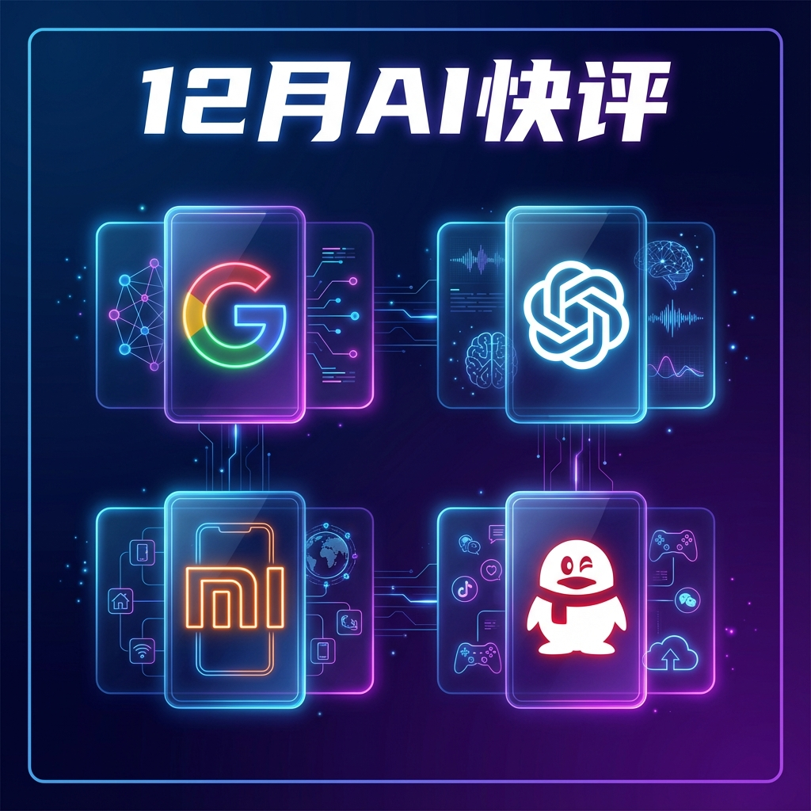
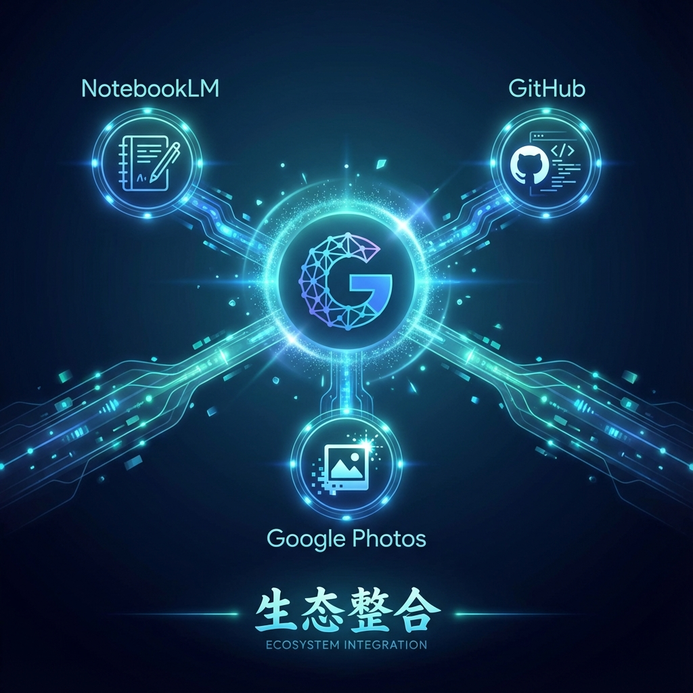
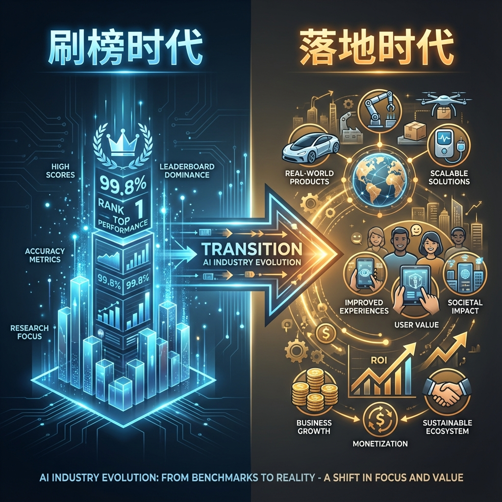

快到年末，在圣诞休假前，各家公司都纷纷交出自己的收官作品（再卷起来）。

> 💬 **一句话总结**：Google 生态整合发力，OpenAI 产品化追赶，国内玩家各有新招。

---

## Google Gemini：生态整合是真正护城河

升级的 **Flash 3** 最新模型，具备接近 Pro 3 的能力，同时有更快的响应速度，并且 **API 可免费试用**——这一策略直接威胁 OpenAI 的付费墙模式。

此外还有 **Live Audio** 和 **TTS 模型**，效果（比如中文）方面相比之前都有大幅提升。

产品端 Gemini 与 NotebookLM、GitHub、Photos 等打通，**生态整合力进一步加强**——模型能力趋同后，这才是真正的差异化壁垒。

---

## OpenAI：产品侧全面发力

在拿出对比 Gemini 3 Pro 的 **GPT-5.2** 模型后，又推出了新 Images 模型对标 Banana Pro，demo 挺酷炫，能力与 Banana 差不多或略逊一筹。

| 动作      | 说明                   |
| :-------- | :--------------------- |
| 界面改版  | 支持分支对话能力       |
| Apps 商店 | 第三方应用生态正式上线 |

大有在产品侧发力的趋势，追赶 Google 的生态布局。

---

## 小米 MiMo：罗福莉的正式亮相

国内小米在大模型上入局后的首次产品发布，**MiMo-V2-Flash** 正式开源，这也是前 DeepSeek 罗福莉的正式亮相。

- **架构**：与 DeepSeek 很接近，参数规模更小
- **技术亮点**：通过 Multi-Token Prediction 实现更低成本、更快响应
- **关注点**：后续在小米"手机/汽车/家居"生态里的落地应用

---

## 腾讯：人才新格局

说到罗福莉，腾讯正式官宣引入了前 OpenAI 的**姚顺雨**作为总裁办首席科学家，整合引领公司大模型的技术迭代。

> 🔑 **洞察**：大模型的新时代，人才也在更新换代。顶尖人才的流动方向，往往预示着行业格局的变化。

---

**小结**：12 月这一波更新的共同主题：**从"刷榜"转向"落地"**。无论是生态整合、产品化提速还是人才布局，都在为真正的商业化做准备。