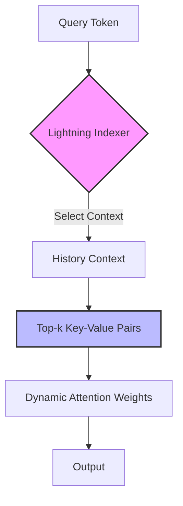
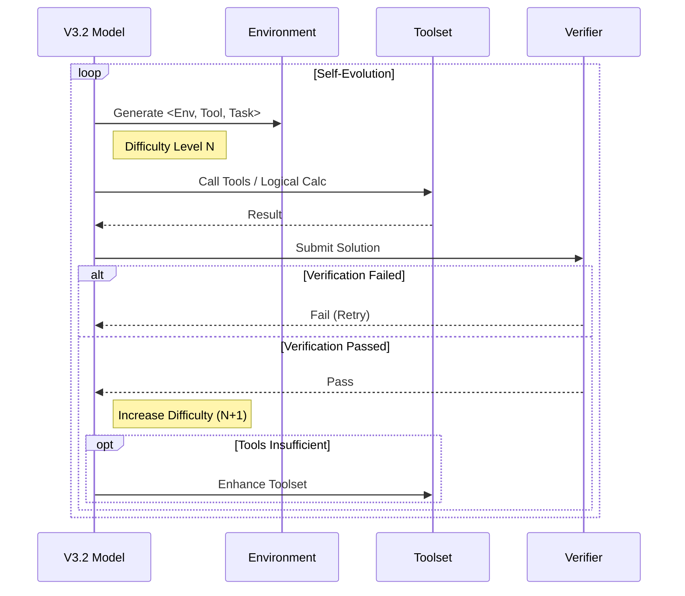

12 月第一天的下午，DeepSeek 终于出牌了。**推理能力全球领先，力压 GPT-5**，与前两周刚出炉的 Gemini 3 Pro 互有胜负。

按照惯例，一同发布的还有可直接访问的服务和 API、开源的模型、以及技术报告。不做商业吹捧，我们直接看技术报告的干货。

V3.2 依然基于 V3 的核心架构，相对于 V3.1-Terminus 的改进主要有三点：

## 一、DSA 稀疏注意力机制 (DSA Sparse Attention)

这个在十一前发布的 V3.2-Exp 模型中已经公布，小虾米也简单介绍过。

*   **核心原理**：通过 `Lightning Indexer` 优先确定查询 token 应选择哪些历史上下文，进而选择 Top-k 索引分数的 key-value 条目，实现动态权重注意力机制。
*   **挑战与突破**：实现并不简单，涉及采样分布对齐、多查询头共享、FP8 提效等。
*   **成果**：最终实现**计算效率提升、成本显著下降**，且性能未出现退化。

我们之前也讨论过 Kimi、Qwen 等开源模型在注意力机制上的优化，均试图从局部最优中跳出，但目前 **DeepSeek 方案是已知最省成本的**。

## 二、改进的强化学习框架 (Improved RL Framework)

这是相比于 V3.2-Exp 效果大幅提升的关键。

*   **技术核心**：框架基于前沿的 **GRPO (Group Relative Policy Optimization)** 训练算法。
*   **稳定性扩展**：
    *   **无偏 KL 估计**：消除系统估计误差，促进收敛。
    *   **负优势序列掩码机制**：提升从错误中学习的能力。
    *   **路由保持**：保留推理采用的 MoE 专家路由训练推理能力等。
*   **Scale Law 效应**：实现了推理资源投入增加带来性能提升的效果。这与我们讨论 Gemini 3 Pro 的后训练红利是一致的，并且也给出了类似 GPT-5/Gemini 随推理资源增加效果增强的 **V3.2-Speciale 模型**。

## 三、增强数据提供的 Agent 泛化能力

从技术布局上感觉 DeepSeek 在 Agent 能力训练上略慢于 Kimi、Qwen，但这次直接给出**大规模智能体虚拟训练场构造方法**，效果上直接追到前沿水平。

*   **训练方法**：基于 V3.2 模型生成 `<环境，工具，任务，验证>` 的训练数据。
*   **强制交互**：强制要求 AI 智能调用工具或执行逻辑计算，直到验证通过。
*   **自我修炼**：当任务通过后，进一步提高任务难度；若现有工具集不足以解决问题，则增强工具集。

如此不断自我修炼，迭代的任务难度使得 GPT-5-Thinking 也面临挑战。生成的大规模训练数据可**显著提升模型在复杂交互环境中的泛化能力和指令遵循能力**。

---

> **One More Thing**
> 值得一提的是，官方公布以上训练**未参考测评集数据**。这说明 DeepSeek 的初衷并非是刷分，而是落地应用。这个态度本身便是国产模型自信强大的体现。