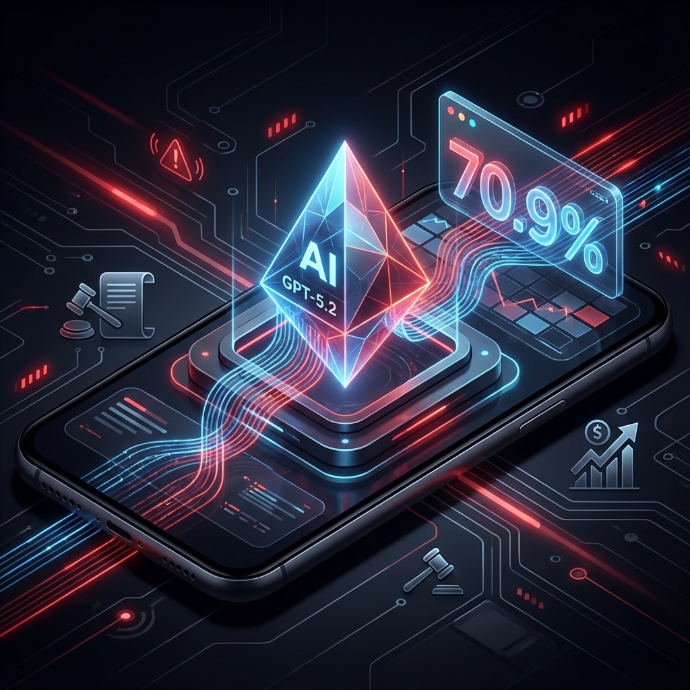

迫于 Gemini 3 的竞争压力，OpenAI 拉响红色警报，紧急推出了 **GPT-5.2**。

> 💬 **一句话评价**：主要亮点在于自建 GDPval 测评集上的优化，科学、编程等任务相比 GPT-5.1 有进步，但普通用户难以感知，甚至可能带来负向体验。

---

## GDPval：衡量 AI 经济价值的新标尺

**GDPval** 是 OpenAI 于 2025 年 9 月推出的测试集，其设计目标是模拟真实世界中的**职业任务**，以此衡量 AI 模型替代人工劳动的潜在经济收益。

GPT-5.2 Thinking 在 GDPval 上的"胜率 + 平局率"达到 **70.9%**，尤其在以下领域表现突出：

- 📜 **法律文件撰写**：失误率显著降低
- 📊 **精确财务计算**：准确性大幅提升

这一数据意味着，在约 **七成任务**中，GPT-5.2 已超越具备 10 年经验的人类专家。

---

## 测评 ≠ 可替代

然而，测评成绩亮眼并不意味着 AI 可以直接替代人类专家。以下三方面原因值得深思：

| 挑战维度           | 具体分析                                                                                                          |
| :----------------- | :---------------------------------------------------------------------------------------------------------------- |
| **责任归属**       | AI 无法"背锅"——即便只有 30% 的出错概率，最终责任仍需由人类承担                                                    |
| **迭代交互能力**   | 测评仅是单次交付评估，而真实场景中"人在回路"（Human-in-the-Loop）的迭代协作，可能使普通模型也能达成不错的最终结果 |
| **复杂任务与品味** | 在复杂决策、审美品味、多模态深度理解等方面，AI 仍有很长的路要走，测评集难以代表真实业务场景的全部复杂性           |

> ⚠️ **结论**：GDPval 是一个有价值的经济影响力评估工具，但将测评成绩直接等同于"AI 可替代人类"仍需谨慎。
