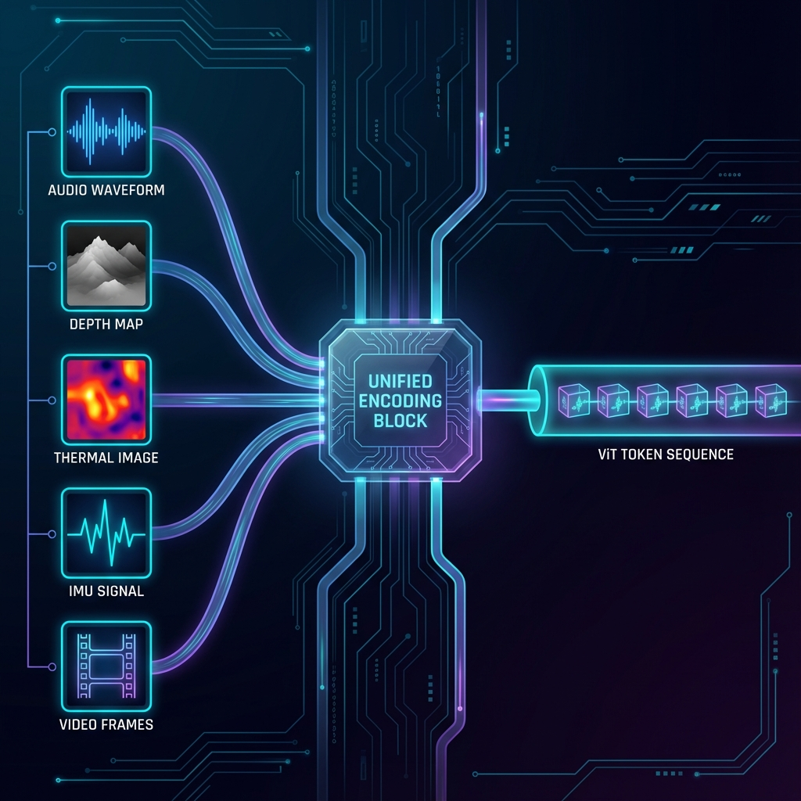
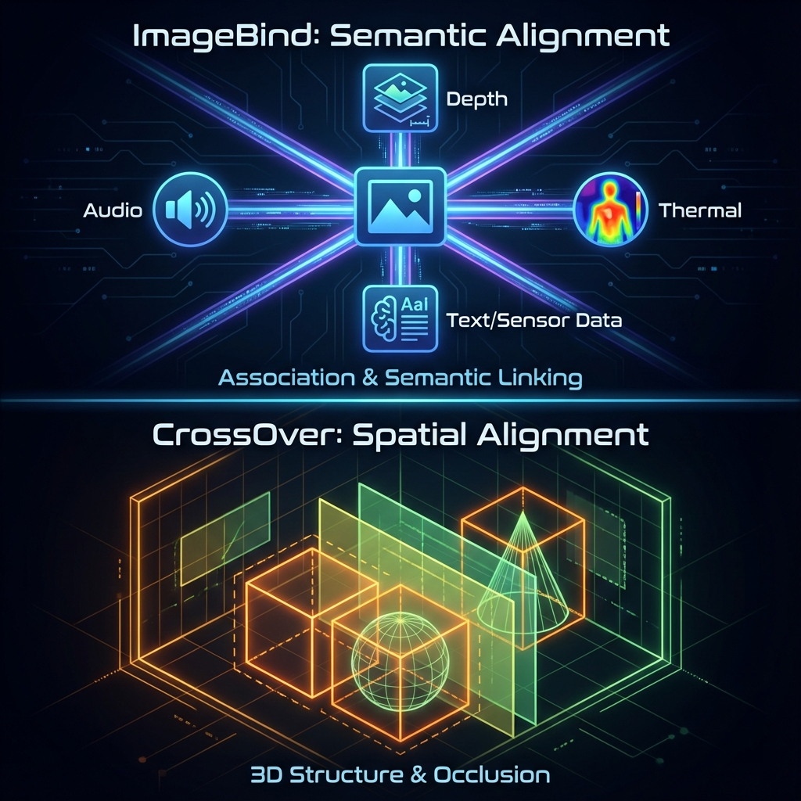

在 [[Introduce ViT&CLIP|ViT & CLIP]] 和 [[introduce BLIP|BLIP]] 的文章中，我们了解了如何通过 ViT 将图像编码，并利用 CLIP 将文本模态对齐，从而统一了图文的理解与生成任务。

然而，真实世界的信息远不止图像和文本。一个关键问题随之浮现：

> 音频、视频、深度、热成像等更多模态的数据，是否也能被纳入这个统一的表达体系中？

---

## ImageBind：万物皆可 Embedding

2023 年，Meta AI 提出了 **ImageBind** 框架，其宏大的愿景是将音频、视频、深度信息、热成像、3D 点云、IMU（惯性测量单元）等六种模态对齐至同一个统一的嵌入空间（Embedding Space）。

### 核心思想：以图像为中心

ImageBind 的核心策略是**以视觉模态为锚点**（Anchor）。其原理基于一个深刻的洞察：视觉数据在现实世界中经常与其他模态自然共现。因此，只要将每种模态都与视觉模态两两对齐（通过类似 CLIP 的对比学习方法），其他模态之间就可以实现自动对齐，而无需直接的配对数据。

### 模态编码器的统一设计

为实现这一目标，ImageBind 巧妙地将不同物理性质的信号转化为 ViT 可以处理的形式：

| 模态                 | 预处理与编码方式                                                                                              |
| :------------------- | :------------------------------------------------------------------------------------------------------------ |
| **音频** (Audio)     | 将 2 秒音频采样转换为**梅尔频谱图**（Mel-spectrograms），这是一张时间 × 频率的二维图像，随后直接使用 ViT 编码 |
| **深度** (Depth)     | 深度信息本质为单通道图像，为保持尺度不变性，通常转换为**视差图**（Disparity Map）再做 ViT 编码                |
| **热成像** (Thermal) | 本质为红外辐射强度的单通道图像，可直接作为单通道输入进行 ViT 编码                                             |
| **IMU** (Motion)     | 惯性测量单元产生的运动信息是时间序列数据，使用 1D 卷积投影为 Token 序列，然后由 Transformer 编码              |
| **视频** (Video)     | 将其视为 2 帧的图像序列，使用“时间膨胀”的 ViT 编码，复用空间特征提取能力                                      |

### 涌现对齐 (Emergent Alignment)

ImageBind 第一次实现了跨模态的**“涌现”对齐**。

例如，模型从未在训练中见过“音频”和“热成像”的配对数据，但因为它们都分别与“图像”对齐了，它们在向量空间中也自然靠近。

> 💡 **实际应用**：这种多模态理解能力为后续的智能应用奠定了基础，例如在文生视频模型中生成与画面匹配的音效，或者赋能 **Meta Ray-Ban Glass** 等具备多模态感知能力的智能硬件。

---

## CrossOver：空间认知的进化

如果说 ImageBind 实现了**感知层**（Semantic）的多模态统一，那么 2025 年 CVPR 提出的 **CrossOver** 架构则构建了**空间层**（Spatial）的多模态对齐。

### 从语义到空间

CrossOver 将点云、网格模型（Mesh）、文本描述、光栅平面图与图像模态对齐到了一个统一的**空间认知层**。

它的核心突破在于，不再仅仅理解对象“是什么”（语义），而是深入理解物体在 3D 空间中的：
*   **布局** (Layout)
*   **遮挡关系** (Occlusion)
*   **对应关系** (Correspondence)

这一架构的提出，标志着多模态大模型从单纯的“识别与生成”迈向了真正的“空间理解”，为具身智能机器人理解复杂物理环境提供了关键的认知模型。

---

## 参考文献

1. Girdhar, R., et al. (2023). [ImageBind: One Embedding Space to Bind Them All](https://arxiv.org/abs/2305.05665). *CVPR 2023*.
2. Sarkar, D., et al. (2025). [CrossOver: 3D Scene Cross-Modal Alignment](https://arxiv.org/abs/2502.15011). *CVPR 2025*.