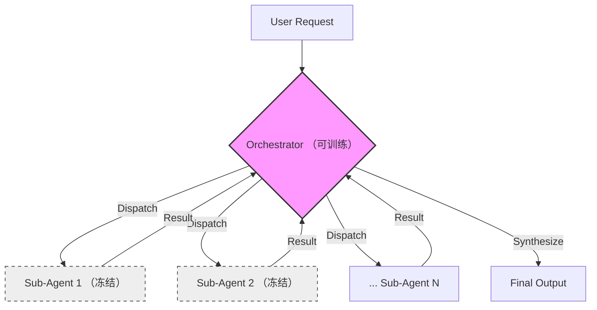

![[kimi-swarm-cover.png|Kimi 2.5 Agent Swarm 概念图]]
> **OpenAI 和 DeepSeek 还在卷“思维深度”的深井，Kimi 2.5 却掉转船头，冲向了“执行广度”的旷野。**
> 这不仅仅是模型参数的提升，更是一场关于“群体智能”的暴力美学实验。

2024 到 2025 年的 AI 叙事，几乎都被 CoT（思维链）和 RL（强化学习）垄断。我们习惯了惊叹于模型“想得有多深”。

但**现实世界的痛点往往不在于“太难想”，而在于“太繁琐”**。

我是数据小虾米。今天不做商业吹捧，我们剥开最新出炉的 Kimi 2.5 市场包装，直接看技术干货：**Agent Swarm 到底是不是伪命题？PARL 架构究竟是创新还是妥协？**

---

## 🏗️ 范式转移：从单体天才到百人军团

传统的 AI 工作流是线性的：`Plan -> Execute -> Check`。这有个致命弱点：**前缀陷阱 (Prefix Trap)**。第一步走错，后面全是无用功。

Kimi 2.5 的 **Agent Swarm（智能体集群）** 试图用 PARL (Parallel-Agent Reinforcement Learning) 打破这个诅咒。

### 核心论点：空间换时间

它不再执着于 Test-time Compute scaling of **Depth**（让一个大脑想得更久），而是彻底转向 Scaling of **Breadth**（让一百个大脑同时干活）。

| 维度 | 传统 Agent (串行) | Kimi 2.5 Swarm (并行) |
| :--- | :--- | :--- |
| **核心隐喻** | **爱因斯坦**：依赖单个超强大脑的深思熟虑 | **包工头**：指挥 100 个熟练工并行搬砖 |
| **瓶颈** | **前缀陷阱**：一步错，步步错 | **通信开销**：通过并行试错覆盖搜索空间 |
| **效率** | **O(N)**：线性增长 | **O(1)**：理论上的常数级时间 (宽搜索场景) |

资料显示，在处理宽搜索（Wide Search）场景时，Kimi 2.5 将端到端执行时间减少了 **80%**。这本质上是用 **100 倍的算力消耗，换取了 4.5 倍的时间加速**。

---

## 🧩 PARL 架构：为了稳定的“层级独裁”

多智能体系统（MAS）一直有个业界圣杯：如何自动化编排？但这里有个巨大的坑——**非平稳性 (Non-stationarity)**。如果大家都在学，环境就在乱变，最后谁也学不会。

Kimi 2.5 的解法**极其务实，甚至带有一种工程上的“妥协”艺术**：

> **架构公式**：
> $$ \text{System} = \text{Trainable Orchestrator} + \text{Frozen Sub-agents}$$

### 架构图解

为了避免“串行崩溃”（模型发现并行太难，偷懒回退到单线程），Kimi 2.5 引入了 **分阶段奖励塑形 (Staged Reward Shaping)**，强行奖励早期的并行尝试。

**辩证分析**：
这并不是真正的去中心化“涌现”智能（那是蚁群算法的事）。这是一种**层级化的独裁结构**。

* **优点**：工业级可控，适合高并发、低耦合任务（如批量扫财报）。
* **缺点**：对于强耦合的逻辑推理，收益递减。

---

## 👁️ 原生多模态：品味是隐性知识

在 Agent Swarm 的光环下，Kimi 2.5 的视觉能力容易被低估。

不同于外挂 Vision Encoder 的“拼接怪”，Kimi 2.5 在 15 万亿 token 预训练阶段就混合了视觉数据。这意味着它具备了 **视觉编程 (Coding with Vision)** 的能力。

* 它可以直接看懂 UI 设计稿的动效逻辑。
* 月之暗面特别强调了 **“品味” (Taste)** —— 这是一种很难用文本描述，但一眼就能看出来的审美直觉。

在 MMMU Pro 上 78.5% 的得分证明了：**开源模型正在迅速填平与闭源顶流（GPT-5/Gemini）的沟壑。**

---

## 💸 算力围墙：普通人的“奢侈品”

尽管 Kimi 2.5 标榜"开源"，但请不要产生"我能在笔记本上跑它"的错觉。

这是一个 **1 万亿参数 (1.04T)** 的巨兽。即使是 MoE 架构（激活 32B），这一脚油门下去的显存消耗也是惊人的。

**算力成本公式**可以简单概括为：

$$
\text{Cost}_{total} = \text{Base\_Inference} \times \text{Agent\_Count} \times \text{Interaction\_Turns}
$$

在 Swarm 模式下，单次任务可能触发数百次调用。

* **私有化部署**：那是拥有 H100 集群的大厂游戏（估算门槛 $500k）。
* **API 调用**：虽然单价 ($0.60/1M) 看起来良心，但指数级增长的 Token 消耗量会教你做人。

**本质上，Kimi 2.5 是给企业级用户准备的“核武器”，而不是给个人开发者的“瑞士军刀”。**

---

## 📝 总结：智能编排已来

Kimi 2.5 是一个重要的路标。它证明了：**我们可以用“执行的广度”来暴力破解现实世界的复杂度。**

但这种能力并非没有代价。

* 它牺牲了纯粹的去中心化，选择了层级化控制。
* 它牺牲了低成本的普惠性，选择了高性能的暴力美学。

未来，我们期待的不仅仅是 Agent 数量的增加，而是编排器（Orchestrator）能变得更聪明——**不仅知道“派谁去干”，更知道“何时该停”。**

这，才是真正的智能。
