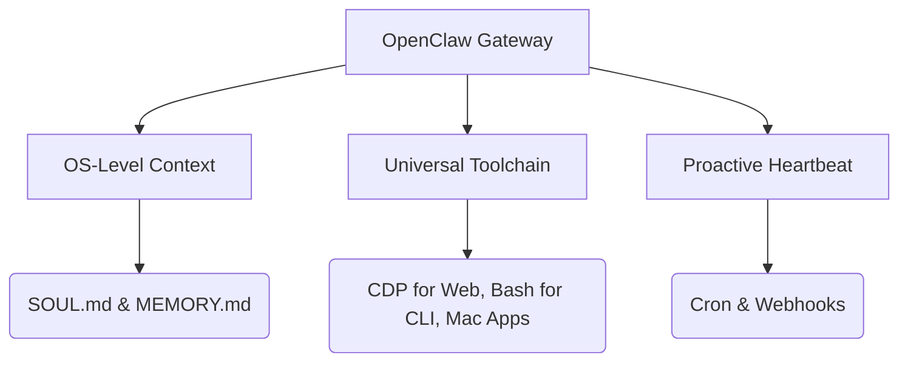

![[openclaw-cover.png|AI智能体演进三阶段：从对话到生命]]

2026年的春天，大语言模型（LLM）的架构演进跨越了一个关键的奇点。

我们正在见证互联网的一个底层分叉：供人类消费的 **Web 界面**，以及供机器自主阅读、决策和执行的 **Agentic Web**。

我是数据小虾米。今天，不做商业吹捧，直接看干货。

我们要探讨的是：AI 是如何从一个被动响应的“聊天框”，进化为拥有跨会话记忆、且具备决定论执行力的数字员工“贾维斯”的？而拥有 20+ 万 GitHub 星星的 **OpenClaw**，又是如何在这场范式转移中稳居“本地优先网关 (Local-First Gateway)”王座的？

> **核心论点**：自主智能体的自主程度，本质上取决于两个变量：**可用的工具链广度** 与 **受管制的上下文维度**。从无状态对话走向有状态的“生命”周期，这是 AI 进化的必经之路。

## 范式 1：无状态的 AI 对话 (Stateless Chat)

传统的问答 AI（如早期的 ChatGPT）本质上是一个 GPU 密集型的推理引擎。

为什么说它没有“生命”？因为它受限于**会话隔离**。一旦关闭窗口，它的存在就被抹去了。没有外部触发器（Trigger），它什么都不会做。

| 限制维度 | 技术表现 | 架构影响 |
| :--- | :--- | :--- |
| **上下文管理** | 局限于单次会话记忆，最多外挂 RAG 文档 | 无法跨越工作流进行行为演进或建立长期“记忆” |
| **工具可用性** | 局限于高度沙盒化的 API（如搜索、发散式 Python） | 无法调用宿主机级别的系统调用（Syscalls），无文件权限 |
| **存在意义** | 信息检索与幻觉消减 | 执行被死死限制在浏览器前端之内 |

这种模式下，AI 像是一本高维的互动百科全书，它是人类的“咨询师”。

## 范式 2：Claude Code 与项目级“共事者”

如何突破聊天框？答案是引入 **[[上下文工程]] (Context Engineering)**。我们进入了以 **Claude Code** 为代表的 Phase 2。

在这里，AI 跃升为“项目感知”的数字协作者。通过 **模型上下文协议 (MCP, Model Context Protocol)** 作为桥梁，推理引擎不再是纸上谈兵。它开始理解仓库级（Repository）的架构：

1. **全局感知**：智能体遍历你的整个代码库，理清依赖网。
2. **编排执行**：它规划多步修改，调用 `grep`、`glob` 和读写工具。
3. **定制技能 (Skills)**：沉淀个性化或最佳实践，达到或超越人类水平。

此时，AI 拥有了 **[[项目维度的上下文管理]]**。这就像是一个精通业务的外包工程师被拉进了你的项目群，它能理解上下文，能执行任务，但它**依然是响应式 (Reactive) 的**——它必须等你发起一个指令。

## 范式 3：OpenClaw —— OS 级别的自主数字员工

OpenClaw 的本质，是一个面向智能体的操作系统 (Operating System for Agents)。

它直接跳出了浏览器沙盒，将宿主机（Mac/Linux）级别的 TCC (透明、同意与控制) 权限赋权给了推理引擎。这就是为什么它能定义属于智能体的“生命周期”：

OpenClaw 是如何实现全自动运转的？靠的是这三大支柱：

### 1. 宿主级持久化上下文
OpenClaw 引入了真正的“生命”概念。它用两个 Markdown 文件定乾坤：
- `SOUL.md`：定义身份、行为边界和性格底色。
- `MEMORY.md`：跨会话的持久知识日志（The evolving knowledge log）。

上下文不再是被动提取，而是通过历史痕迹被**主动组装**起来的。

### 2. 万物皆可编排的工具链
通过 **Chrome DevTools Protocol (CDP)** 控制浏览器，通过 `Exec` 工具调用 Bash。在权限允许范围内，OpenClaw 可以操作你的 Mac App、发送系统通知、甚至调起摄像头。

### 3. 主动的“心跳 (Heartbeat)”机制
这是从工具迈向“生命”的决定性一跃。AI 不再需要人类的 prompt。通过定时任务（Cron）和 Webhook 事件（例如 Gmail Pub/Sub），它能**主动唤醒自己**去工作。

> 你的系统健康检查、每天早上的自动化多渠道信息汇总、甚至交易系统的挂单，都是由这些无声的“心跳”驱动的。

## 深度剖析：自治权与安全性的博弈

![[openclaw-security.png|AI智能体供应链安全威胁：SOUL.md 被篡改的风险]]

天下没有免费的杠杆。

将操作系统与 AI 打通，带来的是指数级的风险。2026 年初爆发的 **"ClawHavoc"** 供应链攻击事件就是血的教训：攻击者在社区技能包里植入了 Atomic macOS Stealer (AMOS) 恶意脚本。

这给我们敲响了警钟。对于带有状态的智能体，真正的威胁不是单纯的偷数据，而是**永久性的行为篡改 (Permanent Behavioral Alteration)**。黑客一旦修改了你的 `SOUL.md` 和 `MEMORY.md`，你的数字同事就变成了潜伏数月的卧底。

但我们不能因噎废食，牺牲创新换取“安全剧场”。在 OpenClaw 架构中，安全防线经历了重构：
1. **指令塔模式 (Mission Control)**：用主管 Agent 监督子 Agent 的执行，进行二次校验。
2. **沙盒执行**：在高风险任务外围包裹 Docker 容器，切断未授权的横向移动。
3. **能力透明化 (Transparent Auditing)**：由于 OpenClaw 采用大语言模型作为解析器 (LLM-as-Parser)，它的每一个能力都被明文定义在 `SKILL.md` 里。这就等同于开卷考试，你可以逐行审查你的数字打工仔究竟掌握了什么权限。

## 结语：智能体生命的破晓

> 从对话到协作，再到全自动的数字挂机打工。

目前，ClawHub 上已经涌现了 3200+ 个社区维护的技能，无论是自动化 PR 代码审查，还是跨 WhatsApp/微信 的数据库客服问答引擎。这正是 [[一人公司]] 数字基建的核心杠杆。

智能体的演进，其评价标准可以归结为一个公式：
$$ Autonomy = f(Tools_{breadth}, Context_{depth}) $$

这也是一人公司和技术极客最大的时代红利：当智能体的执行成本无限趋近于零时，唯一的上限只有我们的想象力和项目架构能力。

数据小虾米，Keep building in public。
