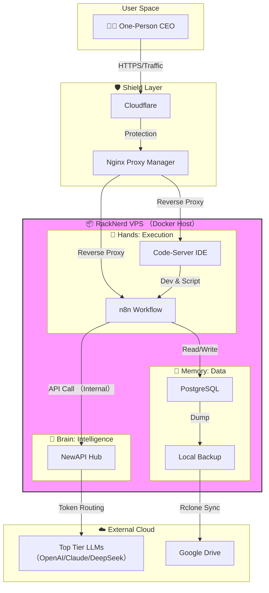

> [!abstract] 核心理念
> **"Data Shrimp" (数据小虾米)** 的哲学是：个体虽小，通过技术杠杆，吞吐海量数据。
> 本文将公开我的一人公司（One-Person Company）的底层架构，这套系统仅需约 $50/年的成本，却提供了不输给 SaaS 订阅服务的算力与灵活性。

## 🏗️ The Big Picture (全景图)

在这个架构中，不依赖昂贵的 Notion AI 或 Zapier，而是完全拥有数据主权。

核心分为四层：
1.  **防护层 (Shield):** Cloudflare + Nginx Proxy Manager (NPM)
2.  **大脑层 (Brain):** NewAPI (聚合 OpenAI, Claude, DeepSeek)
3.  **执行层 (Hands):** n8n (自动化) + Code-Server (云端开发)
4.  **存储层 (Memory):** PostgreSQL (热数据) + Google Drive (Rclone 冷备)

---

## 🛠️ 技术栈选型 (Tech Stack)

### 1. 计算节点 (The Server)
* **硬件:** RackNerd VPS (4 vCPU / 6GB RAM / 100GB SSD)
* **OS:** Debian 12 (Bookworm) —— 极致精简，空载仅占 100MB 内存。
* **理由:** 6GB 内存是分水岭，足够跑起 Java (如果需要) 或大内存的 n8n 工作流。

### 2. 流量网关 (The Gateway)
* **Cloudflare:** 提供 DNS 解析、CDN 加速和 DDoS 防护。开启 `Full (Strict)` 模式。
* **Nginx Proxy Manager:** 运行在 Docker 中的反向代理。
    * **安全策略:** 仅开放 80/443 端口。所有后端服务（如 Port 3000, 5678）均**不暴露**公网 IP，仅通过 Docker 内部网络通讯。

### 3. AI 调度中心 (The AI Hub)
* **NewAPI (One API):**  这是AI核心资产。我将 OpenAI、Claude、DeepSeek 的 Key 全部存入此处，未来还可扩展本地部署模型。
    * **内网加速:** n8n 调用 AI 时，直接走 Docker 内网 (`http://new-api:3000`)，延迟 < 1ms。
    * **降本增效:** 日常任务路由给 **DeepSeek V3** (极低成本)，攻坚任务路由给 **Claude/Gemini/OpenAI**。

### 4. 自动化中台 (The Automation)
* **n8n:**  AI原生工作流，支持开源部署，替代 Zapier/Make。
    * 深度集成了 Telegram Bot 和 Notion，负责 24/7 的信息流转。
* **Python 环境:**  通过 Code-Server 部署了 Miniconda，n8n 可通过 Webhook 触发复杂的 Python 数据分析脚本。

### 5. 数据存储 (The Storage)
* **Rclone + Google Drive:**  将 GDrive 挂载为 VPS 的本地目录，统一存储一人公司相关上下文信息，。
    * **策略:** 每日凌晨 3 点，脚本自动打包 Postgres 数据库并上传云端，实现“归零后 5 分钟复活”的容灾能力。

---

## 💰 成本分析 (Cost Analysis)

这套架构的核心优势是极致的性价比。年付 $50 的预算是如何实现的？

| 项目 (Item)      | 规格/方案 (Spec)           | 价格 (Price)      | 备注 (Note)                        |
| :------------- | :--------------------- | :-------------- | :------------------------------- |
| **VPS Server** | RackNerd (4C/6G/100G)  | ~$45.00 / 年     | 黑五或新年特惠款，6G内存是运行Java/Node等服务的舒适区 |
| **Domain**     | Namecheap / Cloudflare | ~$5.00 / 年      | 简单的 `.com` 或更便宜的后缀               |
| **Cloudflare** | Free Plan              | $0.00           | DNS、CDN、WAF 防护完全免费               |
| **Software**   | Docker + OSS           | $0.00           | NewAPI, n8n, Postgres 均为开源免费     |
| **Storage**    | Google Drive (15G)     | $0.00           | 仅用于存放冷备数据，Personal 版足够           |
| **Total**      |                        | **~$50.00 / 年** | **约合 $4.2 / 月**                  |

> [!info] 隐性成本 (API Token)
> 除了固定设施成本，AI 调用的 Token 费用属于“按量付费”。
> *   **DeepSeek V3**: 主力模型，成本极低 (Input $0.14/1M)，可使用 OpenRouter 提供的 free 模型，日常自动化任务成本可忽略，特定有效果要求的任务可按需使用能力更“强”的付费模型。

---

## 🔒 安全性设计 (Security)

作为“一人公司”，安全性是底线。
1.  **防火墙 (UFW):** 仅允许 SSH, 80, 443。所有 Docker 端口映射 (`-p`) 均绑定 `127.0.0.1` 或直接移除。
2.  **身份验证:** SSH 禁用密码登录，仅限 Ed25519 密钥对。
3.  **权限隔离:** 弃用 `root`，所有服务运行在用户及 `docker` 用户组下。

## 💡 结语

这套架构可实现从繁琐的运维中解放出来，专注于业务逻辑。它不仅是一个技术堆栈，更是**一人CEO**在这个 AI 时代的生存基站。
