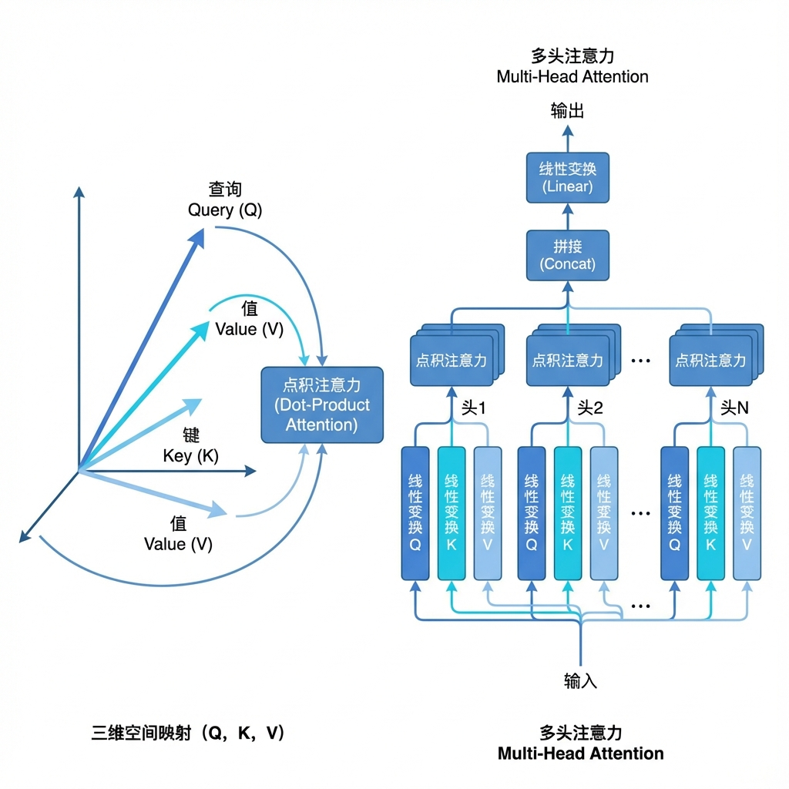

# 终于搞懂了Transformer：ChatGPT背后的"最强大脑"是如何工作的？

> "在AI时代，理解Transformer就等于理解了蒸汽机时代的活塞运动。"

大家好，我是数据小虾米。 🦐

这两年大模型（LLM）火得一塌糊涂，从 GPT-4 到最近的 DeepSeek，哪怕你不是技术人员，可能也听过这些名字。但你有没有想过，**到底是什么让机器突然"听懂"了人话？**

答案就是——**Transformer**。

今天这篇，不堆砌高深公式，我们用通俗的语言拆解这个改变世界的架构。

---

## 01 为什么以前的AI"记性不好"？

在 Transformer 出现之前，AI 处理语言像是在**"死记硬背"**。

传统的 RNN（循环神经网络）读文章是**逐字读**的。读到后面，往往忘了前面。就像一个为了应付考试的学生，死盯着当前的单词，却忘了上一句的主语是谁。

**痛点很明显：**
1.  **记不住**：长难句处理能力差。
2.  **慢吞吞**：只能按顺序算，没法并行加速。

直到 2017 年，Google 团队喊出了一句振聋发聩的口号：
**"Attention Is All You Need"（你只需要注意力）。**

---

## 02 核心秘密：注意力机制（Attention）

Transformer 的核心就是**"注意力机制"**。

简单说，它不再逐字死读，而是像人类高手速读一样：**一眼看全貌，重点看关键。**

为了实现这点，它把每个词（Token）都扔进了一个三维空间里计算。想象你在图书馆找书，这个过程可以拆解为三个角色：

| 角色             | 英文  | 潜台词                                     |
| :--------------- | :---- | :----------------------------------------- |
| **查询 (Query)** | **Q** | "我想找关于'深度学习'的书"（我的需求）     |
| **键 (Key)**     | **K** | "我是《深度学习》这本书的标签"（匹配特征） |
| **值 (Value)**   | **V** | "这是书里的具体内容"（实际信息）           |

**计算过程就是：**
拿着你手中的 Q，去和所有的 K 进行匹配（点积运算）。匹配度越高，也就是"注意力"越集中，最后提取出的 V（信息）就越多。

更有趣的是**多头注意力（Multi-Head Attention）**。
就像是你雇了 8 个专家同时帮你读一本书：
- 专家 A 关注语法结构
- 专家 B 关注情感色彩
- 专家 C 关注逻辑关系
...
大家把看到的信息拼在一起，理解自然就深刻了。

---

## 03 为什么它能大力出奇迹？

Transformer 解决了一个致命问题：**并行计算。**

因为它不需要像 RNN 那样等读完第一个字才能读第二个字，它可以**同时把整篇文章扔进 GPU 里狂算**。

这就好比：
- **RNN**：一个人抄写 100 本书，抄死也抄不完。
- **Transformer**：印书厂流水线，只要机器（算力）够多，一秒钟印 1万本。

这就引出了著名的 **Scaling Law（缩放定律）**：
只要你的模型结构（Transformer）是对的，只要你**疯狂堆算力、疯狂喂数据**，AI 的智能水平就会像坐火箭一样指数级上升。

这就是为什么现在的大模型越来越大，能力越来越强。

---

## 04 它的局限与未来

当然，Transformer 并不是完美的。最头疼的就是**"上下文窗口"**。
文章太长，计算量就会呈爆炸式增长（二次方复杂度）。

所以现在的技术大牛们（如 DeepSeek, Google DeepMind）都在研究怎么突破这个天花板：
- **稀疏注意力**：不重要的词直接忽略，只看重点。
- **线性注意力**：让计算量不再爆炸，比如 Mamba 架构。
- **无限注意力**：像 Google Gemini 那样，搞个"外挂大脑"存记忆，实现 100 万字的上下文。

---

## 写在最后

Transformer 不仅仅是一个模型，它是一种**通用的序列处理思维**。
文字是序列，代码是序列，甚至 DNA、视频帧、机器人动作都是序列。

理解了 Transformer，你就理解了为什么 AI 能在这么多领域同时爆发。

**"一切信息皆可序列化，万物皆可 Attention。"**

---

### 👇 每日互动

你觉得 AI 在理解人类语言上，最大的障碍是什么？欢迎在评论区聊聊！

*如果你觉得这篇内容对你有启发，欢迎**点赞、在看、转发**，这对我很重要！* 🌟

---

### 🚀 更多深度内容

👉 **blog.datashrimp.space** — 我的数字花园，更多 AI 技术深度解析

---

**我是数据小虾米**，一个用AI技术拆解焦虑、迭代人生算法的普通人，在这里记录我的航行日志，欢迎同行。

