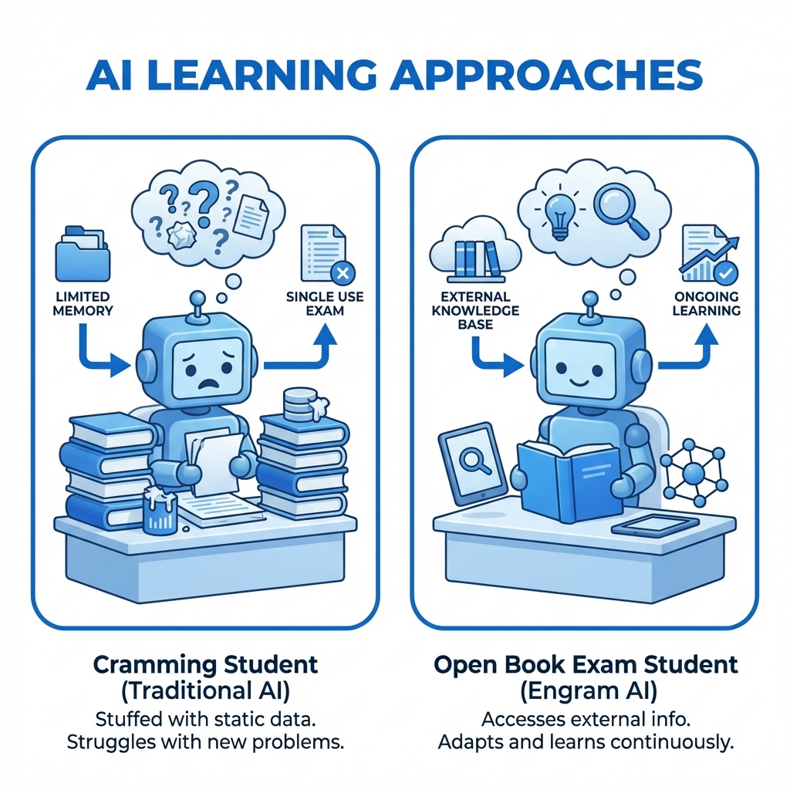

# 🎯 核心价值
这篇文章能帮读者理解 DeepSeek 最新开源的 Engram 架构，明白为什么大模型需要将"记忆"与"计算"解耦，以及这对降低推理成本的革命性意义。

## 📝 标题备选
1. DeepSeek 开源 Engram：拒绝死记硬背，大模型终于学会"开卷考试"了
2. 告别显存焦虑！DeepSeek 新架构让 AI 记忆成本降低 75%
3. 关于大模型记忆的 3 个认知误区，DeepSeek 这次全打破了
4. DeepSeek-V3 之后又一神作：Engram 如何重新定义 AI 的"记忆"？
5. 如果你也在关注大模型效率，这篇关于 Engram 的解读值得一看

## 📖 正文

**DeepSeek 开源 Engram：拒绝死记硬背，大模型终于学会"开卷考试"了**

大家好，我是**数据小虾米**。

最近 DeepSeek 动作频频，继 V3 之后，又开源了 **Engram** 架构。

很多朋友问我：*“这东西到底有啥用？是新的模型吗？”*

先说一个反常识的结论：**Engram 不是为了让模型“算”得更快，而是为了让模型学会“偷懒”。**

---

### 01 为什么大模型需要“作弊条”？

想象一下，如果让你背诵整本《牛津字典》，无论问你哪个生僻词，你都得靠“脑子”（神经元）立刻反应出来。这不仅累，而且极其浪费脑细胞。

现在的 Transformer 模型就是这样——它把所有的知识都“死记硬背”在昂贵的 GPU 显存里。

**这就导致了两个问题：**

1.  **贵**：显存比内存贵太多了，把所有知识都塞进显存，成本极高。
2.  **慢**：哪怕问一个简单的“李白是哪个朝代的”，模型也要调动几百亿个参数陪跑一圈。

这就好比为了查一个单词，动用了一台超级计算机。

而 DeepSeek 的 Engram，就是给大模型发了一本**教科书**。

### 02 Engram 的核心：把记忆“外包”出去

Engram 做了一件极其聪明的事：**把“计算”和“记忆”分家。**

*   **大脑（GPU）**：负责复杂的逻辑推理，比如写代码、做数学题。
*   **书包（CPU 内存）**：负责存储海量的死知识，比如历史事实、常用词组。

这就是所谓的**非参数化记忆（Non-Parametric Memory）**。

当模型遇到问题时，它会先判断：
*   如果是复杂推理，就动用 GPU“大脑”去算；
*   如果是简单知识，直接去 CPU“书包”里查 N-gram 表。

这就好比考试的时候，允许**开卷**。简单的公式直接翻书（查表），只有难题才动脑子推导。

### 03 甚至比 MoE 更进一步

我们都知道 MoE（混合专家模型）是让“不同专家负责不同领域”。

而 Engram 则是引入了**“条件记忆”**。这也是继 MoE 的“条件计算”之后，大模型效率领域的又一里程碑。

| 范式                  | 核心机制       | 类比                             |
| :-------------------- | :------------- | :------------------------------- |
| **条件计算 (MoE)**    | 只激活部分参数 | 让物理老师教物理，体育老师教体育 |
| **条件记忆 (Engram)** | 查阅 N-gram 表 | 能查书的坚决不背，省下脑子思考   |

### 04 效果怎么样？

数据不会说谎。

在同等 27B 参数规模下，使用 Engram 架构的模型，不仅训练成本（FLOPs）持平，而且性能**优于基准模型**。

这意味着，我们可以在不增加计算成本的情况下，通过廉价的内存（DRAM）来无限扩展模型的知识库。

**省下来的 GPU 显存，全都可以用来做更深度的推理！**

---

### 05 写在最后

DeepSeek 的这一波操作，让我想到了人类的学习过程。

初学者往往在死记硬背，而真正的高手建立索引。

Engram 的出现再次证明了：**大模型不必总是通过“计算”来获取答案，“记忆”与“推理”的有机结合，才是通往高效智能的必经之路。**

未来的 AI，或许不再是那个无所不知的“书呆子”，而是一个手握百科全书、懂得如何快速检索的“超级学者”。

---

我是**数据小虾米**，一个用AI技术拆解焦虑、迭代人生算法的普通人。
在这里记录我的航行日志，欢迎同行。

🔗 更多深度内容请访问：blog.datashrimp.space
👆 点击上方蓝字关注「数据小虾米」

如果这篇文章对你有帮助，欢迎 **点赞、在看、转发** 三连 💪

## 📊 摘要
DeepSeek 开源 Engram 架构，提出"条件记忆"新范式。通过将海量简单知识卸载到廉价的 CPU 内存中，让 GPU 专注于复杂推理。这就像让模型学会了"开卷考试"，在大幅降低显存依赖的同时，实现了比传统架构更优的性能。

## 🎨 配图建议
- 封面图：展示“大脑（GPU）”与“书本（DRAM）”连接的概念，科技感中带有一点温暖的手绘风。
- 内嵌图：Engram 架构的简易示意图（GPU 查表流程）。
- 视频：30秒解说“什么是条件记忆”。

## 💡 发布策略
- 最佳发布时间：周三 18:00
- 朋友圈同步文案：DeepSeek 只要一出手，就是降维打击。这次的 Engram 直接教大模型"开卷考试"，显存焦虑有救了？[链接]
