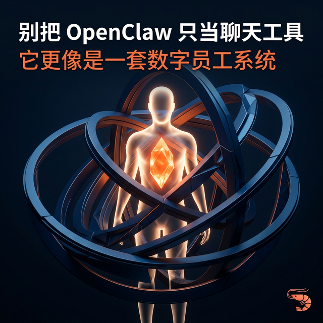
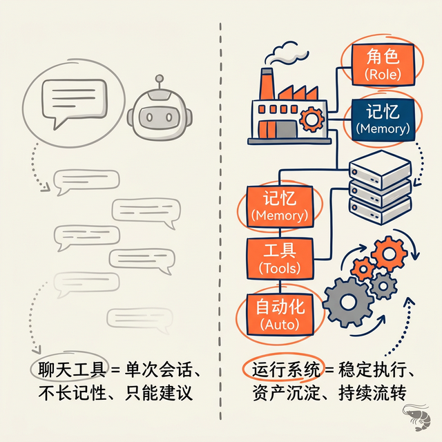
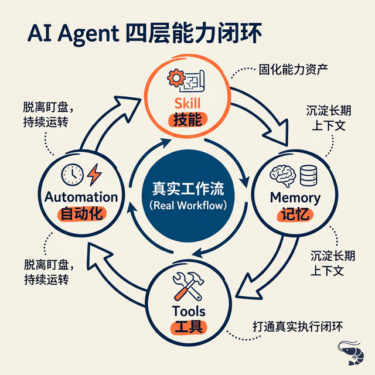

# 别把 OpenClaw 只当聊天工具，它更像一套数字员工运行系统

最近我在养龙虾 OpenClaw，有一个判断越来越明确：如果你把它理解成“更强一点的 AI 聊天工具”，你大概率会低估它。

如果把这件事说得更直接一点，OpenClaw 最有价值的地方，不是回答能力，而是运行能力。

它真正解决的，不是“怎么让模型更会聊天”，而是怎么把模型、skill、memory、tools 和 automation 接起来，让 AI 从一次性的会话能力，慢慢变成一种可持续运行的执行能力。

所以我现在更愿意把 OpenClaw 理解成一套**数字员工运行系统**。

这不是为了把概念说得更大，而是因为只有换到这个视角，很多原本看起来零散的能力，才会真正对齐到同一个问题上：**AI 到底能不能进入真实工作流。**

## 一、很多人会以为自己在比较聊天工具，但真正比较的是运行系统

很多人第一次看 Agent 产品，习惯先问：它和 ChatGPT、Claude、Gemini 到底有什么区别？

这个问题当然成立，但它默认了一个前提：你是在用“聊天产品”的框架理解它。

可 OpenClaw 更接近的，其实不是一个更聪明的聊天框，而是一个可以挂上角色、记忆、工具、自动化和任务流转的 runtime。

换句话说，如果只盯着“答得好不好”，你其实是在用错评估维度。

从运行层来看，真正值得追问的问题应该是：

- 它能不能承载一个稳定角色，而不是每轮都重新设定？
- 它能不能把高频动作沉淀成 skill，而不是每次重新写 prompt？
- 它能不能把长期有效的背景信息沉淀到 memory？
- 它能不能接入 tools，形成真正的执行闭环？
- 它能不能靠 cron、消息触发和异步执行，形成持续运行能力？

只要把视角切到这里，你就会发现，OpenClaw 真正要解决的已经不是体验优化问题，而是生产系统问题。

前者关心的是对话质量，后者关心的是能力沉淀、上下文管理、任务执行和协作稳定性。

这两件事差得非常远。

## 二、OpenClaw 的门槛，本质上不是“难用”，而是“开始要求你做系统设计”

我越来越觉得，OpenClaw 的门槛不能简单理解成“配置有点麻烦”。

更深一层看，它是在逼你回答那些以前用聊天工具时可以一直回避的问题。

比如：

- 这个 Agent 的岗位职责到底是什么？
- 它的权限边界在哪里？
- 遇到不确定情况，是继续执行、停下确认，还是升级处理？
- 哪些内容值得沉淀成长期记忆，哪些只属于临时上下文？
- 哪些动作适合自动触发，哪些必须保留人工审批？

这些问题如果放在聊天工具里，通常只是使用习惯；但一旦进入运行系统，它们就会变成基础设施问题。

所以很多人会觉得这类产品“重”，本质上不是因为它不会聊天，而是因为它要求你开始把 AI 当成一个需要被组织、被约束、被管理的执行系统。

如果你只是想偶尔问几个问题，这套东西当然显得重。

但如果你真的想让 AI 进入内容、研究、运营、自动化这些工作流，那这些看起来麻烦的东西，恰恰是土但重要的部分。

## 三、OpenClaw 真正有价值的，不是单点能力，而是四层能力开始闭环

如果只看单点能力，OpenClaw 里很多东西都不是第一次出现。

聊天，别家也能做。
工具调用，别家也在推。
记忆、定时任务、多 Agent 协作，外面也都有类似表达。

但 OpenClaw 真正值得看的，不在这些概念本身，而在于这些能力开始被组织成一个闭环。

### 1. Skill：把 prompt 从临时输入，变成能力资产

很多团队现在还在高估 prompt，低估系统。

Prompt 当然重要，但它天然有一个问题：它太依赖当轮会话。

你这次讲清楚了，下次还得再讲；换个人来操作，表达方式一变，输出质量就会波动。

Skill 的价值就在这里。

它把一类任务的目标、流程、边界和输出约束固化下来，让能力不再只存在于某次聊天里，而开始变成可以复用、维护、迭代的资产。

如果把这件事说得更直接一点：

- prompt 更像即时输入
- skill 更像组织资产

当 AI 使用开始从前者走向后者，系统才真正有可能进入稳定生产。

### 2. Memory：让 Agent 不再每次都重新入职

没有 memory，很多 Agent 本质上都只是临时工。

今天你把偏好讲一遍，明天又讲一遍；今天把边界说清楚，下次它又像第一次认识你。

Memory 真正重要的地方，不是为了制造“它很懂你”的幻觉，而是为了建立一个稳定的上下文层。

哪些判断是长期有效的，哪些协作习惯值得保留，哪些项目背景不该每轮重讲，这些都需要被沉淀、被检索、被持续校准。

如果没有这一层，所谓数字员工，很容易永远停留在实习生阶段。

### 3. Tools：让 AI 从建议者变成执行者

很多 AI 产品的问题不是不会说，而是只能说。

一旦没有工具层，很多场景最后还是停在“给建议”这一步。你获得了很多答案，但真正昂贵的执行衔接，还是要靠人自己补。

Tools 的意义，就是把 AI 从建议层往执行层推。

当它能读写文件、调浏览器、发消息、跑脚本、处理定时任务，它才开始真正接近“做事”，而不只是“说事”。

所以判断一个 Agent 系统有没有进入生产，不要只看它能不能答，更要看它有没有接上执行闭环。

### 4. Automation：让系统脱离“你盯着它，它才开始工作”的状态

这是最容易被低估的一层，但其实非常关键。

如果一个系统每次都必须等你打开窗口、输入指令、盯着执行，它本质上还是一个被动式助手。

但如果它能接住：

- cron 定时任务
- 消息触发
- 后台执行
- 异步完成后回报
- 跨 session 的任务传递

那它就开始有一点“持续运行”的属性了。

而持续运行，恰恰是数字员工和聊天工具之间最核心的分界线之一。

## 四、真正决定它能不能跑起来的，不是模型有多强，而是你有没有支点

我越来越喜欢用“杠杆和支点”去理解这类系统。

OpenClaw 当然像杠杆，而且是一根很长的杠杆：模型、记忆、工具、自动化都接上来了，看起来什么都能撬。

但杠杆能不能起作用，不只取决于它有多长，更取决于你有没有支点。

这个支点通常不是一个神 prompt，也不是最新模型的名字，而是更朴素的东西：

- 你的任务目标清不清楚
- 完成标准明不明确
- 哪些步骤能标准化
- 哪些步骤必须人工判断
- 哪些风险点需要人工兜底

很多人会以为，装上 Agent 系统，效率杠杆就会自动出现。

但真正的问题是，如果你的工作本身还没有被组织成一个可执行结构，那 Agent 往往不会把混乱变清楚，反而会更快地放大混乱。

所以我现在对这类系统的判断越来越简单：

**它给你的是杠杆，但你得自己准备支点。**

## 五、为什么“数字员工系统”是一个更准确的理解框架

我之所以越来越倾向于用“数字员工系统”这个说法，是因为一旦换成这个心智，很多关键问题会一下子对齐。

你不会只盯着它有没有某个功能，而会开始追问：

- 岗位说明书怎么写？
- 协作边界怎么定？
- 输出标准怎么统一？
- 什么任务可以授权？
- 什么任务必须审批？
- 怎么避免它看起来一直很忙，但其实没有形成交付？

这些问题，本质上都已经不是“AI 会不会回答”的问题了，而是“系统能不能稳定运行”的问题。

这也是我觉得 OpenClaw 更值得认真看的地方。

它不是单纯把聊天能力做强一点，而是在把 AI 往真实组织协作的方向推。

## 六、如果真要落地，别一上来就堆复杂编排

对大多数团队或者个人来说，更现实的路径不是一开始就上多 Agent、大编排、大自动化。

先跑通一条最小可用闭环，往往更重要。

我会更建议这样开始：

1. 先定义一个足够具体的岗位
2. 把输入、输出、边界和异常处理写清楚
3. 用 skill 固化一类高频任务
4. 用 memory 沉淀长期有效背景
5. 再逐步接入 automation 和异步执行

这条路径不花哨，但更像系统建设，而不是能力演示。

很多 Agent 项目最后没跑起来，不是因为模型不够强，而是因为一开始就在追求“看起来很厉害”，却没有先把最小闭环跑通。

## 结语

我现在看 OpenClaw，已经不太把它当成一个 AI 工具评测对象了。

我更愿意把它看成一个信号：AI 下一阶段真正拉开差距的，可能不是谁的聊天更丝滑，而是谁先把模型、skill、memory、tools 和 automation 组织成了一个能长期运转的系统。

如果只是聊天，大家比的是模型。

如果进入工作流，大家比的就是系统。

而 OpenClaw 真正有价值的地方，我觉得就在这里。
