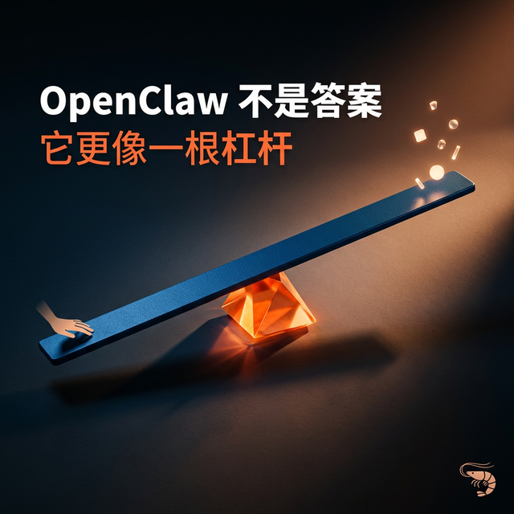
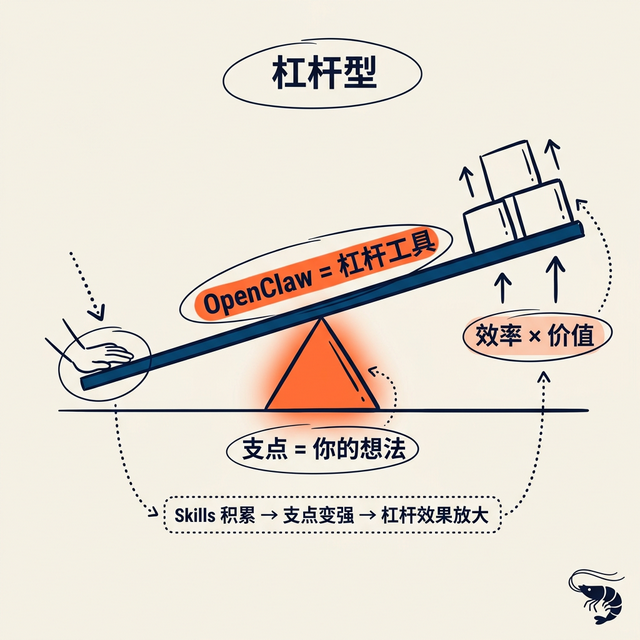
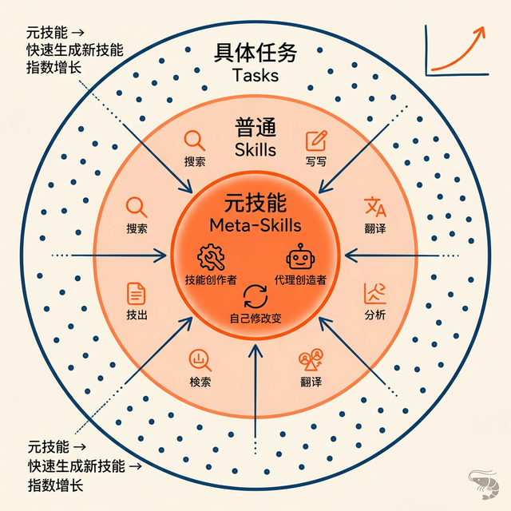
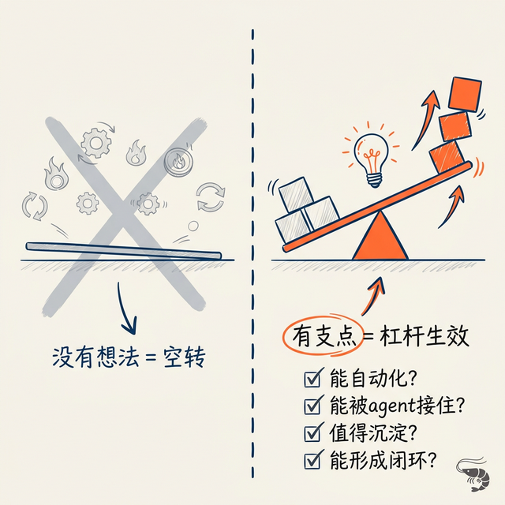
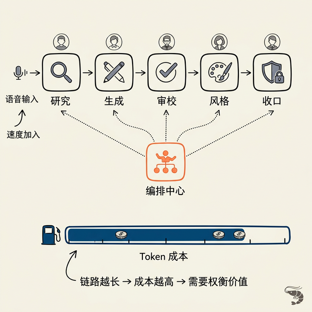

# OpenClaw 不是答案，它更像一根杠杆

我最近一直在想一个问题：

**为什么有些人用了 OpenClaw 之后，会觉得“这东西真厉害”，而有些人用完之后，只觉得它是一个更复杂的大模型聊天工具外壳？而且成本高还不安全！**

想来想去，我现在的答案越来越清楚：

**问题往往不在工具本身，而在你有没有支点。**

如果没有支点，再长的杠杆也抬不动东西。  
OpenClaw 对我来说，越来越像这样一种工具。

它不是那种“装上就会立刻惊艳你”的产品。  
更准确地说，它像一个可塑性很高、但也带着明显工程属性的底座。  
有想法的人，会越用越顺；没想法的人，最后很可能只是多了一套更复杂的配置和更高的 token 成本。

如果把这段时间的实践整理一下，我大概想明白了 5 件事。

---

## 1. OpenClaw 现在还不算一个“纯试玩型”产品

如果说得更直接一点：

**OpenClaw 现在还不够稳定。**

不是说它不能用，而是说它还处在一个持续改进、持续演化的阶段。  
很多能力都很有潜力，但也意味着你需要自己有一点动手能力，能排查问题，也得有基本的安全意识。

这时候，如果只是想简单试玩，先用一些第三方封装得更好的“龙虾版本”，我觉得反而更合理。  
先把感受建立起来，再决定要不要直接下场养本体。

---

## 2. 养龙虾最关键的能力，其实是 skills

很多人刚接触 OpenClaw，会先看这些：

- 能接多少模型
- 能接多少渠道
- 能不能多智能体
- 有没有节点
- 能不能远程执行

这些当然都重要。  
但如果只盯着这些功能表，还是太表层了。

我现在越来越觉得，**真正决定你后面养龙虾顺不顺的，是 skills。**

而在所有 skills 里，我最看重的不是普通技能，而是**元技能**。比如：

- `skill creator`
- `agent builder`
- `self improving`

因为普通 skill 更多是在解决一个具体任务。  
元技能解决的是：以后你怎么更快长出新的能力，怎么让这个系统越来越像你自己。

---

## 3. 真正的差异，不是框架有多强，而是你有没有想法

这件事我现在的判断非常明确：

**OpenClaw 最核心的门槛，不是部署，而是想法。**

如果没有想法，没有值得被放大的问题，没有值得长期积累的流程，那它最后给你的感觉，大概率还是和普通大模型差不多。

所以我会说：

**养龙虾的核心，其实是想象力。**

不是空想，而是那种能看见支点的想象力：

- 这件事能不能被自动化？
- 这个流程能不能被 agent 接住？
- 这个反复出现的痛点，值不值得沉淀成一个 skill？
- 这个想法如果做成闭环，会不会形成杠杆？

---

## 4. 语音输入和多智能体编排，会是很强的效率放大器

如果继续往效率层面看，我现在特别看重两样东西。

### 第一是语音输入
很多时候，限制效率的不是 agent，而是我们自己输入想法的速度。

### 第二是多智能体编排
当事情复杂起来以后，一个 agent 往往是不够的。

你会需要：
- 一个研究
- 一个生成
- 一个审校
- 一个做风格拟合
- 一个做品牌收口

但这里有一个很现实的问题也必须一起说：

**效率背后是 token 成本。**

链路越长、agent 越多、上下文越重，消耗就越明显。  
所以后面要看的不是“能不能这么做”，而是值不值。

---

## 5. 工具只是杠杆，支点才是最重要的

如果把前面几件事合起来，我现在会把 OpenClaw 定义成：

**一个工具杠杆。**

而杠杆这件事，最关键的永远不是杆子本身，而是支点。

- 没有支点，杠杆没有意义
- 支点太弱，杠杆放大不了多少东西
- 只有当支点足够明确、足够有价值时，杠杆才会真正产生收益

所以我现在最看重的，反而不是 OpenClaw 又多了哪个功能、如何部署等。

我更在意的是：

> **我到底想借它放大什么？**

这个问题不清楚，后面的自动化、多智能体、skills、节点，最后都可能只是更复杂的空转。

但如果这个问题清楚了，OpenClaw 的意义就完全不一样。  
它会从一个“AI 工具”变成一个“认知和执行的放大器”。

---

## 最后

所以如果你问我：

**OpenClaw 值不值得养？**

我现在的答案会很简单：

- 如果只是想试玩，先用第三方 xxxClaw 体验
- 如果你已经有明确支点，它很值得
- 如果你愿意积累 skills，尤其元技能，它的复利会很大
- 如果你愿意把想法做成闭环，它会越来越像一个真正的杠杆系统

归根结底，工具本身不是最重要的。  
最重要的，还是你有没有那个值得被放大的支点。

---

我是**数据小虾米**，一个用 AI 技术拆解焦虑、迭代人生算法的普通人。  
在这里记录我的航行日志，欢迎同行。

👆 点击上方蓝字关注「数据小虾米」

如果这篇文章对你有帮助，欢迎 **点赞、在看、转发** 三连。
