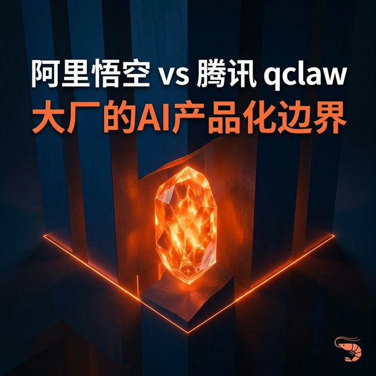
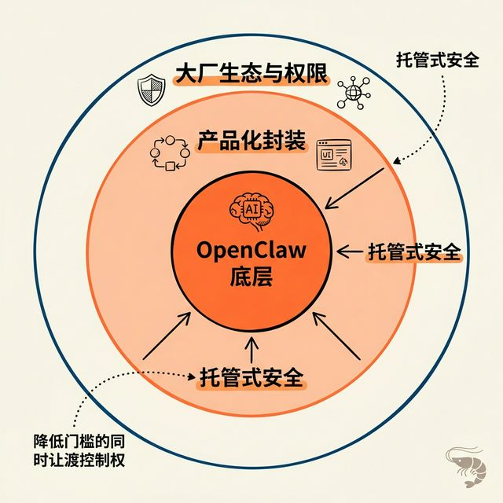
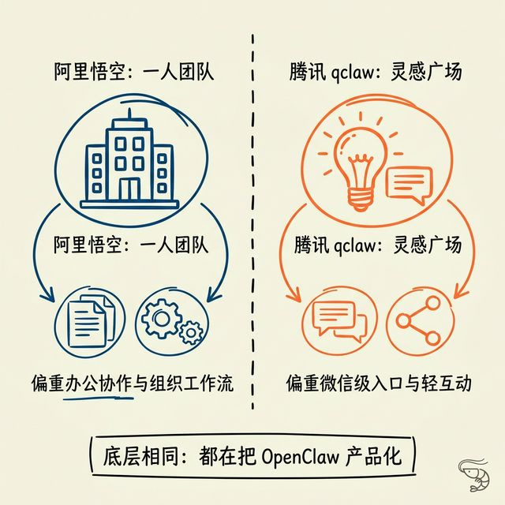
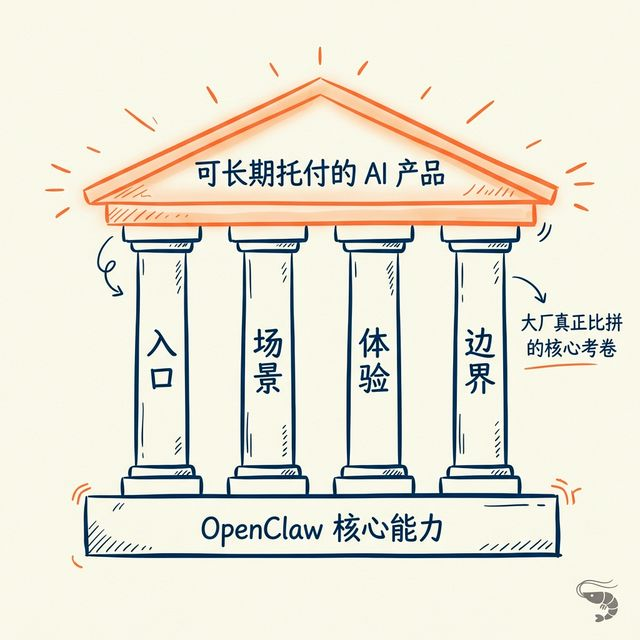

# 如何看待阿里悟空和腾讯 qclaw 这类 AI 助手产品？我的试用结论是：能体验，但别太早长期托付

## 先说结论
如果只把阿里悟空或者腾讯 qclaw 当成两个不同品牌的 AI 助手来看，容易看浅了。

我这次两边都试下来，更在意的一点其实是：**它们真正让人犹豫的，不是能不能用，而是你准备把多少数据、权限和工作流交给它。**

所以我的结论不是“不能用”，而是：

**可以体验，但如果你已经准备把它当成长期生产力工具，别太早托付。**

因为现阶段大家比的，不是谁先接上了 OpenClaw，而是谁能先把入口、场景、体验和边界真正跑通。

---

## 一、先看共性：底层其实差不多，大家都在做产品化封装

我这次一个比较明显的感受是，阿里悟空和腾讯 qclaw，虽然外面长得不一样，但底层逻辑其实差不多。

说白了，都是在做同一件事：
- 把原本偏折腾、偏工程化的 OpenClaw
- 做成更多普通用户也能先上手的产品
- 再接上自己的生态、权限体系和使用入口

所以如果只盯着表层功能，很容易看成“谁功能多一点，谁少一点”。

但我觉得真正值得看的不是这个，而是：**同样都是 OpenClaw，大厂最后会把它分别包成什么样的产品。**

阿里和腾讯的差异，不只是功能差异，更是入口差异、场景差异和产品定位差异。

---

## 二、它们共同解决的，都是一个真实问题：让更多人先用起来

这一点必须先承认。

OpenClaw 这类能力，本来就有比较高的使用门槛：模型接入、环境搭建、技能安装、权限配置、工作流编排，任何一层都可能把很多人挡在门外。

大厂做产品化封装，最大的现实价值就是：**先把第一步变简单。**

这一点无论是阿里悟空，还是腾讯 qclaw，本质上都在做。

对很多人来说，他们不是不想用，而是根本迈不过第一步。所以大厂的第一层价值，并不是把能力上限拉多高，而是让原本用不起来的人，至少先跑起来。

---

## 三、但它们提供的安全，更像一种托管式安全

很多人看到大厂下场做这种产品，会天然觉得更安全。

这个感觉不是完全没有道理。因为平台通常会提供权限体系、审计能力、沙箱机制和企业部署的风控包装。

但问题在于，这种安全并不是“风险消失了”，而是**风险、责任和控制权被重新分配了。**

换句话说：
- 原来是你自己管系统
- 现在是平台替你管系统
- 原来是你自己定义边界
- 现在越来越多边界是平台预设的
- 原来你自己承担复杂度
- 现在你用托管换取省事

所以我会把它定义成一种托管式安全。

它当然比很多人自己乱搭要稳，但它并不意味着你真正掌控更多了。

---

## 四、阿里的打法更像“先接住办公和组织协作”

先说阿里悟空。

阿里这边比较明显的感觉，是它更偏向办公场景和组织协作场景。它预装了一些技能，还包装成“一人团队”模式，这个命名本身就已经很说明问题了。

我试了里面的知识博主相关能力，一个很直观的感受是：它确实能帮一个原本没那么会折腾的人，更快地把资料整理、基础输出和内容生产拉到平均线以上。

这个价值不能低估。因为很多人真正需要的，不是一步到位，而是先别太差，先能用。

但问题也很快就会出现。一旦你想再往前走一步，比如想按自己的业务去改技能、按自己的习惯去串工作流、自己选模型、控制数据流向，你就会越来越明显地感受到：**闭源形态会开始变成限制。**

另外，我还试了它通过钉钉去远程控制安装了悟空的电脑。这件事一开始听上去很有想象力，但我实际试下来，无法自如远程操作电脑。产品还在比较早期，不完善的地方很多，还没有到那种“我会放心把高频关键操作交给它”的程度。

所以阿里这边给我的感觉更像是：**先把办公入口、组织协作入口和企业工作流入口接住，再慢慢往更深的执行层走。**

---

## 五、腾讯的打法更像“先守住微信和轻入口，再慢慢放能力”

再说腾讯 qclaw。

我这次试用的版本也是 Windows 版。整体看下来，很多基本判断其实和阿里差不多：门槛确实在降，但实际体验也还没有到特别顺滑的程度。

尤其是在**打开和操作应用**这件事上，我自己的感受是，OpenClaw 对 Mac 的适配目前还是会更顺一些。Windows 这边做起来，不是不能用，但细节体验还不够好，这一点两家都还没有完全解决。

但腾讯这边最值得单独拎出来说的，不是当前产品完成度，而是它**理论上最大的优势非常明确：微信。**

只要腾讯真把微信这个入口、关系链、消息流和使用场景慢慢接进来，它是完全有机会后发先至的。

问题在于，至少从我现在试到的内测版本看，它开放得还是比较克制。目前更明显的是：
- 腾讯电脑管家
- 企微客服转发消息

也就是说，它现在还没有把你想象中的那种“微信级入口优势”真正放出来。

所以腾讯这边现在给我的感觉，不像是已经全力冲出来了，反而更像：**先把入口卡位留住，先守住自己的主场，再慢慢放能力。**

---

## 六、阿里的“一人团队”和腾讯的“灵感广场”，其实已经说明了定位差异

我觉得这次最值得写进去的一个细节，就是两边对外包装的名字本身，已经非常能说明产品定位了。

- 阿里悟空：**一人团队**
- 腾讯 qclaw：**灵感广场**

这两个名字，背后其实就是两种完全不同的产品理解。

阿里更偏：办公、协作、组织流程、生产效率、任务执行。  
腾讯更偏：灵感触发、个人消费场景、轻互动、轻入口。

所以如果只看这一层，你会发现两家其实不是在用同一种方式做产品化。

但再往底下看，事情又会回到那个更关键的判断：**无论是一人团队，还是灵感广场，底层其实都还是 OpenClaw，决定怎么使用的是你自己。**

也就是说，最后真正决定体验的，还是你更需要哪种入口、更习惯哪种场景、又愿意接受哪种边界。

---

## 七、所以现在真正该看的，不是谁更强，而是谁能先把这四件事跑通

如果只问“阿里和腾讯谁更强”，这个问题其实有点太早了。

我现在更愿意看的是，谁能先把下面这四件事真正跑通：

1. **入口**
2. **场景**
3. **体验**
4. **边界**

因为现在看下来，两家都不是在拼底层能力代差。底层都是 OpenClaw，大家真正拼的，是谁能把这套能力包成更多人敢用、愿意留在里面、而且能慢慢长出生态的产品。

阿里的优势更偏办公和组织协作。腾讯最大的潜在优势则是微信。但现阶段，两边都还没有到“闭眼上生产”的程度。

---

## 八、所以我的结论还是：能体验，但别太早长期托付

如果你只是好奇，或者想看看大厂到底怎么把 OpenClaw 这类能力产品化，**可以去试试。**

因为它们确实都解决了一个非常真实的问题：让更多人先把 AI 用起来。

但如果你已经开始认真把这类东西当成长期生产力工具，我现在还是更倾向于两种选择：

### 方案 A：自己养“正版龙虾”
把模型、技能、工作流和数据边界掌握在自己手里。

### 方案 B：继续观望
看看这一波厂商谁能真正把：
- 易用性
- 可控性
- 可信度

三者之间的平衡做好。

因为最后决定它能不能留下来的，不是功能演示漂不漂亮，也不是宣传页讲得多大，而是它能不能在真实工作里，稳定地帮你省时间、产价值，而且让你敢长期用。

---

## TL;DR
- 阿里悟空和腾讯 qclaw 的底层逻辑其实差不多，都是在做 OpenClaw 的产品化封装。
- 它们共同解决的问题，是让更多人先把 AI 用起来。
- 它们共同带来的代价，是托管式安全：你少折腾，也少掌控。
- 阿里更偏办公和组织协作，腾讯更有潜在的微信入口优势。
- 阿里的“一人团队”和腾讯的“灵感广场”，已经说明了两家不同的产品定位。
- 现阶段真正该看的，不是谁更强，而是谁能先把入口、场景、体验和边界真正跑通。

---

## 推荐标签 / 话题
- AI Agent
- 企业级 AI
- 阿里悟空
- 腾讯 qclaw
- 大模型落地

## 评论区可以继续聊的问题
1. 如果是你，你会更看重办公入口，还是社交入口？
2. 你会愿意把自己的核心工作流逐步交给大厂的 AI 助手吗？为什么？
