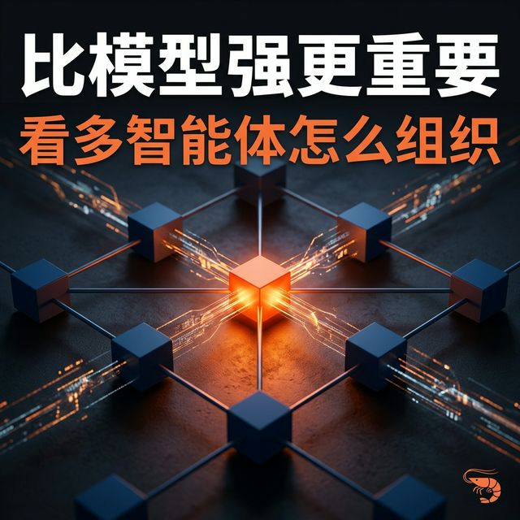
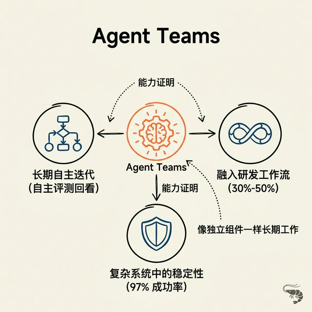
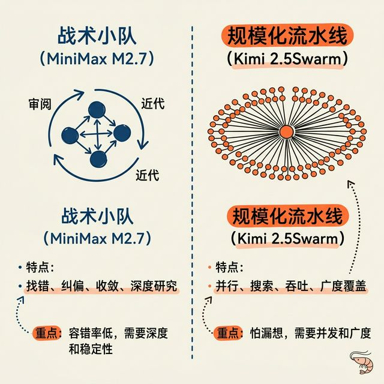

# MiniMax M2.7 之后，更值得看的可能不是“模型更强”，而是“怎么把智能组织起来”

MiniMax M2.7 刚发布时，外界容易关注的还是它又往头部闭源模型靠近了一步：类似 GPT5.4的自我进化、接近 Gemini和 Claude 的编程能力、保持 DeepSeek 风格的高性价比，这些点当然都成立。

从公开材料看，像 **SWE-Pro 56.22%**、**Terminal Bench 2 57.0%** 这样的成绩，已经足以说明它不是普通水平。你把它拿去和这一轮最强的工程类模型比较，也完全说得过去。

但我看完技术材料之后，认为真正重要的是它把另一个更重要的问题推到了台前：

**多智能体团队到底该怎么组织。**

## 一、为什么现在更值得看“组织方式”
单点模型能力当然还在继续提升，但这条线的边际收益已经没有前两年那么夸张了。

前两年大家拼的是一个“更强的大脑”。只要模型本身更聪明一点、更能推理一点，整个行业都会被带着往前跑。

现在这条线当然还在继续，但厂商注意力已经在分流。

一个方向，是 Agent 应用开始变得更具体。围绕 OpenClaw / “养龙虾” 这类真实场景，大家关注的已经不是抽象聊天能力，而是工具调用稳不稳、多步任务能不能跑完、系统能不能长期执行。

另一个方向，就是多智能体协同。

因为当单个模型已经足够强之后，下一个自然问题就是：

**怎么通过组织方式，让一群模型真的比单个模型更能干活。**

所以接下来更值得看的，不只是单兵能力，而是不同厂商会怎么回答“组织智能”这个问题。

## 二、MiniMax M2.7 给出的答案为什么值得看
MiniMax M2.7 给出的答案，是 Agent Teams。

这个词本身没什么魔力，关键还是它拿什么来证明。

我觉得有三条证据是值得留的。

### 1. 它已经进入真实研发流程
官方披露，M2.7 可以处理 **30%-50% 的 RL 研发工作流**，覆盖文献回顾、实验要求跟踪、数据管理、实验监控、读日志、debug、修代码、提 merge request 和 smoke test。

这件事的重要性在于，它展示的不是“会答研究问题”，而是“开始参与研究流程”。

### 2. 它已经展示出持续迭代和回看能力
材料里提到，M2.7 在一套内部实验框架里，连续跑了 **100 多轮** 的失败分析、修改、评测和结果回看。

另一组公开测试里，它在 **22 个任务上做了三次 24 小时自主迭代**，最好的一次拿到 **9 金 5 银 1 铜**，平均奖牌率 **66.6%**。

这里真正值得看的，不是 66.6% 这个数字，而是它说明这个系统已经不只是单次回答，而是能在很长时间里持续推进任务、修正方向、继续收敛。

### 3. 它在复杂系统中的稳定性也更像回事了
公开资料里提到，在 **40 个复杂技能环境**里，它按要求执行的稳定性做到 **97%**。

这个数字的重要性在于：很多模型的问题不是完全不会，而是到了复杂流程里容易跑偏。97% 更像是在说明，它在复杂系统里更稳，更像一个能长期工作的系统组件，而不只是一次性回答工具。

把这几条放在一起看，M2.7 这次真正值得看的，不只是它作为单个模型又强了一点，而是它越来越像一个可以被放进复杂系统里持续工作的模型。

## 三、Kimi 和 MiniMax，给出了两种不同的组织答案
这也是为什么我觉得，Kimi 和 MiniMax 现在是国内最值得重点观察的两条路线。

MiniMax M2.7 更像一支**小型战术小队**。

它拿出来的证明材料，重点不是并发规模，而是补位、找错、回看、修正和收敛。它更像是在回答：复杂任务里，系统能不能自己盯住问题，把事情继续推下去。

Kimi 2.5 的 Agent Swarm，则更像一条**规模化流水线**。

资料里提到它可以协调多达 **100 个子智能体**并行工作，这种组织方式天然更适合广度搜索、任务拆解、批量推进。

所以这里真正值得讨论的，不是谁更先进。

更准确地说，是：

**什么任务更适合什么组织方式。**

## 四、对普通用户来说，这件事已经不只是技术话题了
这件事最后其实会落到一个很实际的问题上：

以后选 AI，除了看能力和性价比，还要看你的任务到底更需要什么样的团队。

如果你的任务更怕出错，比如深度研究、复杂 debug、财务建模、长链路项目交付，那 MiniMax 这种更像小队的系统会更有价值。因为这种任务最需要的不是并发，而是回看、纠偏和收敛。

如果你的任务更怕漏想，比如广度搜索、海量资料整理、大规模信息覆盖，那 Kimi 这种更像流水线的系统会更有价值。因为这种任务最需要的是并发、吞吐和覆盖率。

所以 MiniMax M2.7 这次真正让人觉得有意思的，不只是它又变强了。

而是它把“多智能体团队到底该怎么组织”这个问题，第一次讲得比较具体了。

而这件事，对普通用户来说，也不是一个抽象趋势。

它会直接影响你以后怎么选 AI、怎么分配任务、怎么判断一套系统到底适不适合你的工作流。

