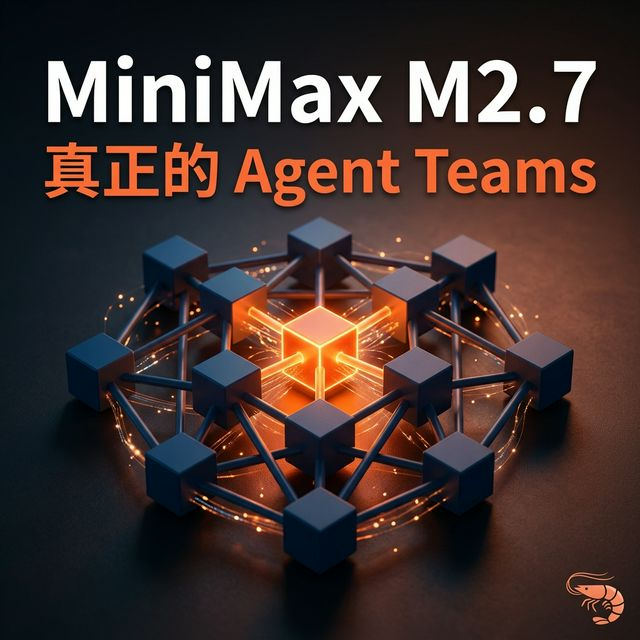
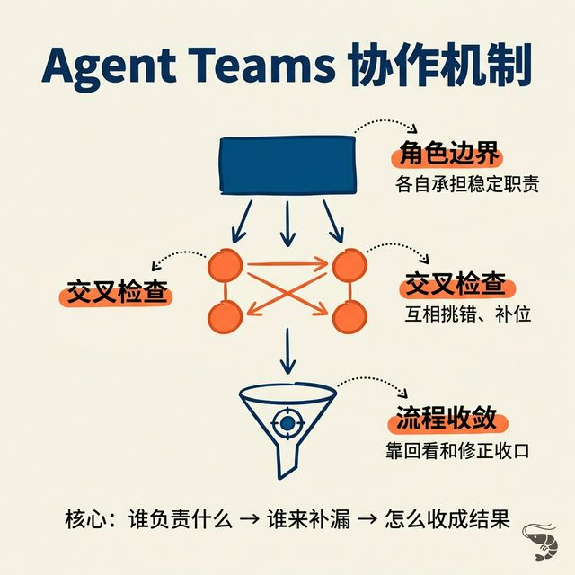

# MiniMax M2.7 这次真正值得看的，不只是它又变强了，而是它开始认真回答：多智能体团队该怎么组织

我先把结论放前面：

**MiniMax M2.7 这次真正值得看的，不只是它的模型能力又变强了，而是它开始把“多智能体团队到底该怎么组织”这个问题讲得更具体了。**

像公开材料里给出的 **SWE-Pro 56.22%**、**Terminal Bench 2 57.0%**，已经足够说明它不是普通水平。把它拿去和这一轮最强的工程类模型做比较，也完全正常。

更值得看的，是它展示出来的另一个方向：当单个模型已经足够强之后，接下来是不是要开始认真讨论——**怎么把一群模型组织起来工作。**

## 一、为什么现在要开始看多智能体协作
我越来越觉得，单点模型能力当然还在继续提升，但这条线的边际收益已经没有前两年那么夸张了。

前两年大家卷的是“超级大脑”。谁更聪明，谁更强，谁更像一个无所不能的模型，这当然重要。

但现在行业注意力已经开始明显分流。

一个方向，是主流厂商开始更认真地做 Agent 应用。比如最近围绕 OpenClaw / “养龙虾” 这类场景，大家关心的就不再只是聊天能力，而是工具调用稳不稳、多步任务能不能跑完、系统能不能持续执行。

另一个方向，就是多智能体协同。

因为当单个模型已经足够强之后，下一个自然问题就是：

**怎么通过组织方式，让一群模型真的比单个模型更能干活。**

所以我觉得，接下来更值得看的，不只是继续卷单兵能力，而是不同厂商会怎么回答“组织智能”这个问题。

## 二、MiniMax M2.7 这次给出的答案是什么
MiniMax M2.7 给出的答案，是 Agent Teams。

当然，谁都可以说自己在做 agent team。真正关键的不是这个词，而是它到底怎么把这件事做出来。

我自己的理解是，它至少在处理三层问题。

第一层，是先把不同 agent 的角色边界尽量固定住，不是大家一起上、谁想到什么说什么。

第二层，是让这些角色之间不只是分工，还要互相挑错、互相补位。你可以把它理解成系统内部保留一层交叉检查，而不是所有 agent 只求配合顺滑。

第三层，是让整个过程别发散，而是能收得回来。所以它很强调回看、修正和收敛。说白了，就是这支 AI 小队不能只是一起干活，而是要在复杂任务里一路把事情盯到能落地。

所以 M2.7 的 Agent Teams，不是简单把多个 agent 摆在一起，而是同时在解决：谁负责什么、谁来补漏洞、最后怎么把任务收成一个结果。

 官方给出的结果证据有 3 条。

### 1. 它已经被放进了自己的研发流程里
官方给出的说法是，M2.7 可以处理 **30%-50% 的 RL 研发工作流**，包括文献回顾、跟踪实验要求、管理数据和 artifact、启动实验、监控进度、读日志、debug、修代码、提 merge request、跑 smoke test。

这件事的意义不是“会回答研究问题”，而是“开始参与研究流程”。

### 2. 它已经展示出长时间自主迭代能力
MiniMax 给出的材料里，M2.7 在一套内部实验框架里，连续跑了 **100 多轮** 的失败分析、修改、评测和结果回看。

另一组公开测试里，它在 **22 个任务上做了三次 24 小时自主迭代**，最好的一次拿到 **9 金 5 银 1 铜**，平均奖牌率 **66.6%**。

这里最值得看的，不是 66.6% 这个数字本身，而是它说明这个系统已经不只是单次回答，而是能在很长时间里持续推进任务、回看结果、继续修正。

### 3. 它在复杂系统里的稳定性也上来了
公开资料里提到，在 **40 个复杂技能环境**里，它按要求执行的稳定性做到 **97%**。

这个数字不花哨，但很关键。因为很多模型的问题不是完全不会，而是到了复杂流程里容易跑偏。97% 更像是在说明：它不只是强，而且在复杂系统里相对稳。

把这三条放在一起看，我觉得 M2.7 这次真正值得看的，不只是它作为一个模型又强了一点，而是它越来越像一个可以被放进复杂系统里持续工作的模型。

## 三、为什么我会把 MiniMax 理解成“小型战术小队”
之前介绍过 Kimi 2.5 Agent Swarm，如果相比较：

MiniMax M2.7 更像一支**小型战术小队**。

因为它现在拿出来证明自己的材料，重点都不是并发规模，而是补位、找错、回看、修正、收敛。它更像是在回答：在复杂任务里，系统能不能自己盯住问题，把事情继续推下去。

而 Kimi 2.5 的 Agent Swarm，则更像一条**规模化流水线**。

资料里提到它可以协调多达 **100 个子智能体**并行工作，这种路线天然更适合广度搜索、任务拆解、批量推进。

所以这里真正值得讨论的，不是谁更先进。

更准确地说，是：

**什么任务更适合什么组织方式。**

## 四、这对普通用户到底意味着什么
我觉得这其实是最重要的一层。

以后选 AI，除了看能力和性价比，还要看你的任务到底更需要什么样的团队。

如果你的任务更怕出错，比如深度研究、复杂 debug、财务建模、长链路项目交付，那 MiniMax 这种更像小队的系统会更有价值。因为这种任务最需要的不是并发，而是回看、纠偏和收敛。

如果你的任务更怕漏想，比如广度搜索、海量资料整理、大规模信息覆盖，那 Kimi 这种更像流水线的系统会更有价值。因为这种任务最需要的是并发、吞吐和覆盖率。

所以我现在看 MiniMax M2.7，最值得看的，不只是它更强了。

而是它让“多智能体团队到底该怎么组织”这个问题，第一次变得比较具体。

而这件事，对普通用户来说，也不是一个抽象趋势。

它会直接影响你以后怎么选 AI、怎么分配任务、怎么判断一套系统到底适不适合你的工作流。

如果你也在用 AI 做研究、写代码、搭工作流或者做数字员工，我更想听听你的真实场景：
你现在更需要的是一个稳定执行的流水线，还是一个会补位纠偏的小队？

这件事，我觉得后面会越来越值得聊。