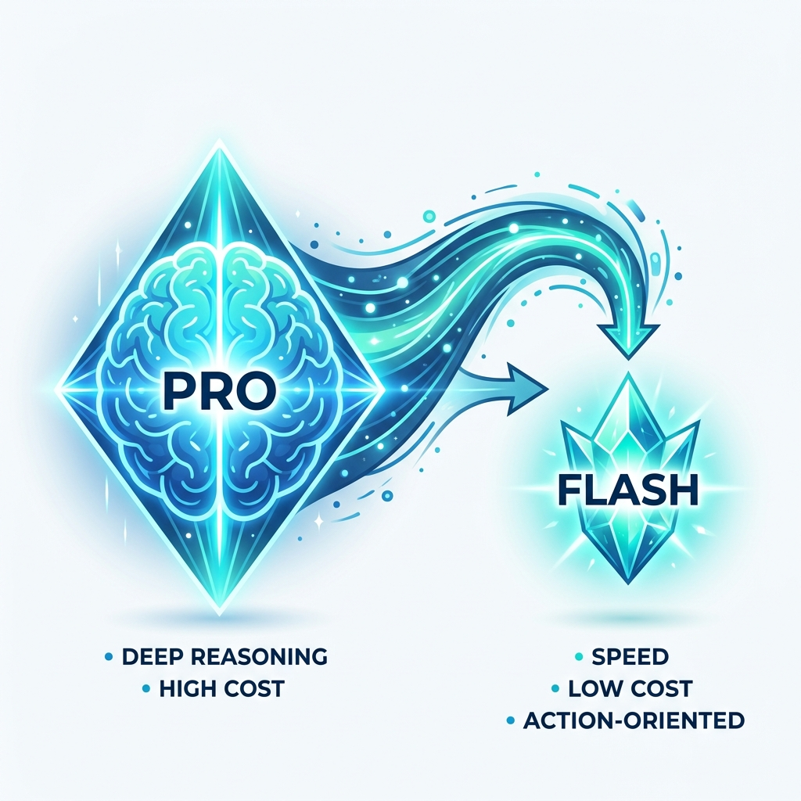
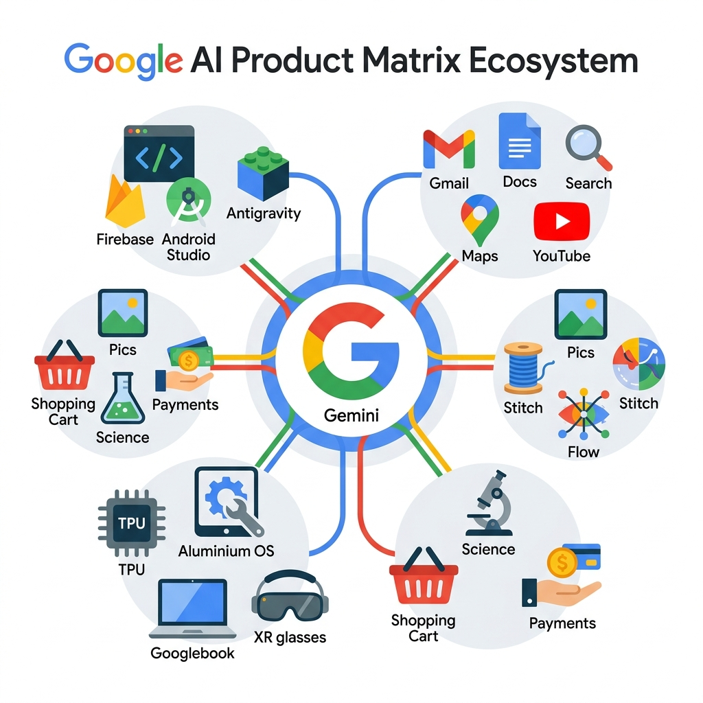
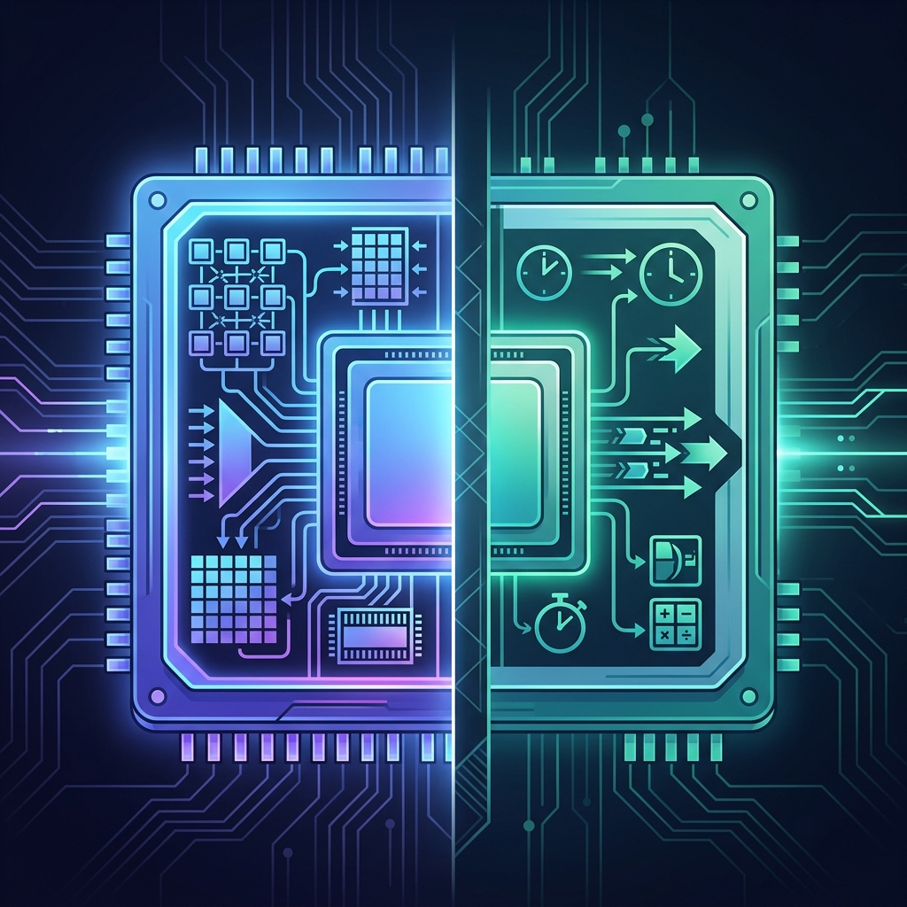

# 🎯 核心价值

帮助读者看穿 Google I/O 2026 发布会背后的 5 步棋局：从模型蒸馏到购物协议，Google 正在从"AI 模型供应商"变成"AI 基础设施运营商"。理解这场变革对开发者、创业者和普通用户意味着什么。

# 📝 标题备选 (5 个)

1. 我花了两天拆完 Google I/O 2026，发现它在下一盘很大的棋
2. Google I/O 2026 的 5 个关键信号，可能改变你未来 3 年的工作方式
3. 从芯片到购物车：Google 的全栈 AI 野心，远比你想的大
4. 为什么说 Google I/O 2026 不是产品发布会，而是一份战略宣言？
5. 别只看 Gemini 3.5 了——Google I/O 背后被忽略的 4 个重磅信号

# 📖 正文

> 当一家公司同时发布新芯片、新操作系统、新购物协议和新科研工具链的时候，它发布的就不是产品，而是一套秩序。

---

5 月 19 日，Google I/O 2026 如期开幕。

两个半小时的 Keynote，我从头看到尾。信息密度大到需要暂停回放好几次。

但看完之后，我脑子里只有一个念头：

**这不是一场产品发布会。**

往年 I/O 的套路是"发模型→晒 benchmark→放 demo"。今年完全不一样。Google 这次展示的，是一整套从芯片到购物车的全栈 AI 战略。

如果用一句话总结：

> **Google 正在从"AI 模型供应商"转型为"AI 基础设施运营商"。它不只是想卖你一个模型，而是想成为你整个数字生活的底层操作系统。**

下面是我拆解出的 5 个关键信号。

不吹不黑，直接看干货 👇

---

## 🔥 信号一：模型策略——先堆后蒸，大力出奇迹

AI 行业有一个永恒的悖论：

最强的模型太贵太慢，便宜快速的模型又不够聪明。

Google 的解法很清晰——

**先不惜代价把旗舰模型（Pro 系列）的能力堆到天花板，然后通过知识蒸馏把"智慧"灌进更小、更快的 Flash 系列。**

这不是新概念。但 Google 这次把执行力拉到了极致。

### Flash 3.5：性价比怪兽

一句话：**接近甚至超过 Pro 的能力，价格不到其一半，速度快 4 倍，工具调用能力更强。**

这意味着什么？

对于 Agent 场景来说，一个需要 30 秒才能完成多步推理的模型，在实际业务中是不可用的。Flash 3.5 把这个延迟打下来了。

**自主 Agent 在经济上第一次变得可行。**

### Omni：不只是视频生成

字节的 Seedance 2.0 主打创意短视频。Google 的 Gemini Omni 走了不同的路——它更像一个**世界模型。

区别在哪？Omni 理解物理规律。你让它改变视频镜头角度、添加物体，它能确保结果符合重力和惯性。

这使得它更适合**影视制作**，而非简单的短视频。

### 定价革命：保险丝式熔断

新模型涨价了，但订阅价格反而降了——

- AI Ultra 新增 $100/月档位
- 旗舰套餐从 $250 降至 $200/月

更重要的是计费逻辑的革命：从"每天能问多少次"变成了**"你用了多少算力"**。

这里面最巧妙的设计是"自动熔断"⚡️——

**当你用完旗舰模型额度后，系统不会断掉服务，而是无缝降级到 Flash 3.5 继续响应。**

就像家里的保险丝：过载时断掉的是大功率电器，灯泡照常亮着。

这是 AI 作为"公用事业"的定价逻辑雏形。就像自来水公司——你用多少水付多少钱，但水龙头永远不会关。

---

## 🧩 信号二：产品矩阵——全面对标，底层打通

模型是发动机，产品才是车。

Google 这次的产品策略用一句话概括：**全面对标竞品，底层技术打通，实现 1+1>2 的生态壁垒。**

### 生产力侧：Antigravity 一分为二

Antigravity 做了一个关键分化：

**Agent 端** → 独立桌面应用 + CLI，对标 Claude Code / Codex。一个 prompt 可以启动多个子 Agent 并行工作。

**代码端** → 回归 IDE 本职。

底层通过 SDK 与 Firebase、Gemini CLI、Android Studio、Chrome DevTools 深度整合。把开发者工具从孤岛变成了网络。

### 消费侧：Gemini 成为生活中枢

- **Workspace 深度融合**：Gmail Live 跨年对话搜索，Docs Live 把口述零散想法变成结构化文档
- **全模态打通**：文字、图像、音乐、语音、视频，一个 Gemini 账号全覆盖
- **Daily Brief（每日摘要）**：每天早上扫你的邮箱、日历、任务清单，生成一份个性化的"今日优先级"

这个 Daily Brief 看起来不起眼，但它可能是**最具黏性的功能** 🎯

一旦你习惯了每天早上被 AI "安排"，你就离不开了。

### 老产品 AI 注入

Google Search 不再返回蓝色链接，而是直接生成"迷你应用"——带可视化和交互的定制面板。

Ask YouTube 精确到秒级时间戳找教程。Ask Maps 用自然语言操作地图和物流。Docs Live 语音脑暴变结构化文档。

**30 年来搜索范式最大的一次变革。**

### 新品 Gemini Spark：你的 7×24 数字主力

这次 I/O 最大的惊喜 ✨

Spark 不是被动等你提问的聊天机器人。它是一个跑在 Google Cloud 上的**持久化个人 Agent**。

Demo 里它管理了一个完整的婚礼计划：追踪 RSVP、发 Gmail 催促、在 Sheets 整理物流——全程不需要你干预。

配套的 **Android Halo** 解决了"后台 AI 黑箱"问题：手机顶部一个微妙的通知条，随时显示 Spark 在做什么。

比如"Spark 正在整理项目邮件" ——你可以安心做自己的事。

但注意，现在只有 Ultra 会员可用。

### 创意工具集转正

Pics（图像）、Stitch（UI 设计）、Flow（视频）、Flow Music（音乐创作）——全部正式上线。

全部支持 **SynthID** AI 生成内容的指纹验证。这是 Google 对"AI 内容真实性"问题的技术回应。

### XR 眼镜：做减法反而赢了

Google 和三星的 XR 策略很聪明——**去掉成像，只做智能音频眼镜** 🕶️

这看起来像功能阉割，实际上是精明的市场策略。

AR 显示屏成本高、续航差、社交接受度低。去掉它，只保留语音助手、导航提示、实时翻译——成本和门槛大幅下降，潜在用户群反而扩大了。

本质就是"能说话的 AirPods + 眼镜框"。先培养佩戴习惯，后续再叠加显示能力。

---

## 🏗️ 信号三：硬件基建——没有芯片，一切都是空谈

所有软件层面的野心，最终都要靠硬件来承载。

Google 今年基础设施资本开支预计 **$1800-1900 亿美元**。这个数字本身就是一道护城河。

### 第八代 TPU：训练和推理终于分家

以前 Google 用一款 TPU 同时干训练和推理。

这次不一样了 ——

**TPU 8t** 专门用于大规模预训练。3 倍上代算力，通过 JAX + Pathways 跨数据中心分发训练任务。全球集群超 100 万颗 TPU。

**TPU 8i** 专为低延迟推理设计。Agent 场景需要毫秒级响应，每一次延迟的降低，都在减少用户"觉得 AI 不够聪明"的错觉。

核心逻辑是：**训练和推理的计算特征完全不同**。塞进同一款芯片是工程妥协。分开做，各自优化，整体效率才能拉上去。

### Aluminium OS：向 Windows 和 Mac 宣战

Google 终于统一了 Android 和 ChromeOS → **Aluminium OS**。

Gemini AI 嵌入操作系统底层。硬件载体是 **Googlebook** 笔记本（Acer、ASUS、联想代工）。

这步棋的野心：通过一个 **AI Native 操作系统**，在笔记本市场向 Windows 和 macOS 发起正面挑战。

---

## 🛒 信号四：进军电商——暗渡陈仓

这是今年 I/O 中最容易被忽视、但可能影响最深远的部分。

### 两个协议：抢占规则制定权

**UCP（Universal Commerce Protocol）**：Agent 自主购物的通用规则。Shopify、Walmart、Amazon 已加入。

**AP2（Agent Payments Protocol）**：Agent 付款授权协议。Agent 可以找货、比价、管理购物车，但**不能自行付款**——必须用户显式授权。

这两个协议的意义不在技术本身。

**谁制定了 Agent 购物的规则，谁就控制了下一代电商流量的入口。**

### Universal Cart：不只是购物车

Demo 中的 DIY 装机场景让我印象深刻：

用户选了一块主板和一颗 CPU，购物车主动提示两者不兼容，并推荐了替代方案。还能追踪价格、库存、商家积分。

**从"商品清单"变成了"智能配置引擎"。**

Google 用购物车暗渡陈仓，悄悄把持住了电商流量的关键节点 🎯

---

## 🔬 信号五：进军科研——AI 的终极杠杆

科技是第一生产力。AI 时代这句话有了新含义——**AI 本身成为了加速科学发现的杠杆**。

- **Gemini for Science**：接入 30+ 生命科学数据库，更多是 AlphaFold 在生物医药领域沉淀的能力输出
- **Weather Next**：AI 天气预报，专攻飓风等极端天气的高精度预测
- **Isomorphic Labs**：AI 制药，压缩药物研发周期
- **Code Mender**：CI/CD 流水线中的安全 Agent，推送生产环境前自动发现和修补漏洞——给软件开发装了一套"免疫系统" 🛡️

---

## ⚖️ 辩证看：Google 的隐忧

不做吹捧，也要看到问题。

**Search 的"引流悖论"** —— 当搜索结果从蓝色链接变成 AI 迷你应用，用户更高效了，但第三方网站的流量被截断了。Google 正在把自己从"路标"变成"围墙花园"。

**执行力是最大变量** —— Google 历史上不缺宏大愿景。从 Google+、Stadia 到 Allo，"起了个大早赶了个晚集"的案例不少。这次全栈覆盖面极广，能否每条线都打穿，是最大的不确定性。

---

## 🎯 我的判断

Google I/O 2026 的终极叙事是：**"导航互联网"的时代正在终结。**

我们正在从"点链接、读网页、手动整合信息"的世界，走向"指挥 Agent 编队在后台完成一切"的世界。

Google 的全栈控制力覆盖了这条链路的每一层：

1. **芯片** → TPU 8i 让实时 Agent 成为可能
2. **模型** → Flash 3.5 平衡深度推理与 4 倍速度
3. **终端** → Aluminium OS 将 Agent 嵌入日常工作流
4. **信任** → SynthID + AP2 提供自主行动的安全保障
5. **标准** → UCP/AP2 抢占 Agent 商业的规则制定权

方向已经很清楚了。

但方向清楚和跑到终点是两回事。让我们保持关注，保持判断。

**Don't just search. Orchestrate.** 🚀

---

我是**数据小虾米**，一个用AI技术拆解焦虑、迭代人生算法的普通人。
在这里记录我的航行日志，欢迎同行。

🔗 更多深度内容请访问：blog.datashrimp.space
👆 点击上方蓝字关注「数据小虾米」

如果这篇文章对你有帮助，欢迎 **点赞、在看、转发** 三连 💪

---

# 📊 摘要 (用于分享)

Google I/O 2026 不只是发布了新模型。从自研芯片到操作系统、从购物协议到科研工具链，Google 正在从"AI 供应商"变成"AI 基础设施运营商"。我拆解了 5 个关键信号：模型先堆后蒸、产品全面打通、硬件训推分离、暗渡电商、进军科研。干货长文，建议收藏。
`博客原文：blog.datashrimp.space`

# 🎨 配图建议

- 封面图：Google I/O 2026 全栈AI生态示意图，芯片→模型→产品→协议→科研的层级结构，航海/探索元素
- 内嵌图 concept_1（信号一后）：模型蒸馏策略示意图——Pro → 蒸馏 → Flash 的流程
- 内嵌图 flow_1（信号二后）：产品矩阵全景图——生产力/消费/硬件/电商/科研五大板块
- 内嵌图 concept_2（信号三后）：TPU 8t 与 8i 双芯片架构对比图

# 🎬 视频导流建议

30 秒短视频脚本：
- 0-5s：Hook——"Google I/O 2026 看完了，说说我的5个判断"
- 5-15s：快速过5个信号（每个3秒，配关键词字幕）
- 15-25s：核心观点——"Google 不是在发产品，而是在制定AI时代的秩序"
- 25-30s：CTA——"完整拆解看公众号，链接在评论区"

# 💡 发布策略

- **最佳发布时间**：周三/周四 20:00-21:00（工作日晚间阅读高峰）
- **朋友圈同步文案**：「花了两天拆完 Google I/O 2026。不只是发了新模型——从自研芯片到购物协议，Google 在下一盘很大的棋。5 个关键信号，干货长文👇」博客原文：blog.datashrimp.space
- **评论区互动策略**：置顶评论"你觉得 Google 这次最让你意外的是哪个发布？欢迎聊聊 👇"
- **公众号简介**：数据小虾米 | 记录一个普通人用AI技术迭代人生算法的实验
